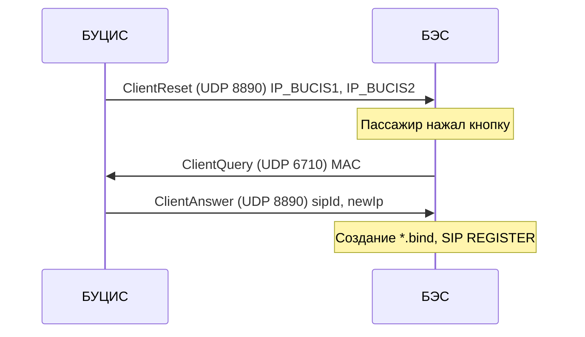
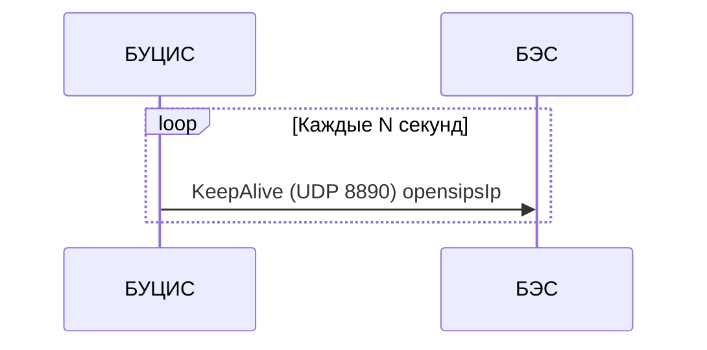
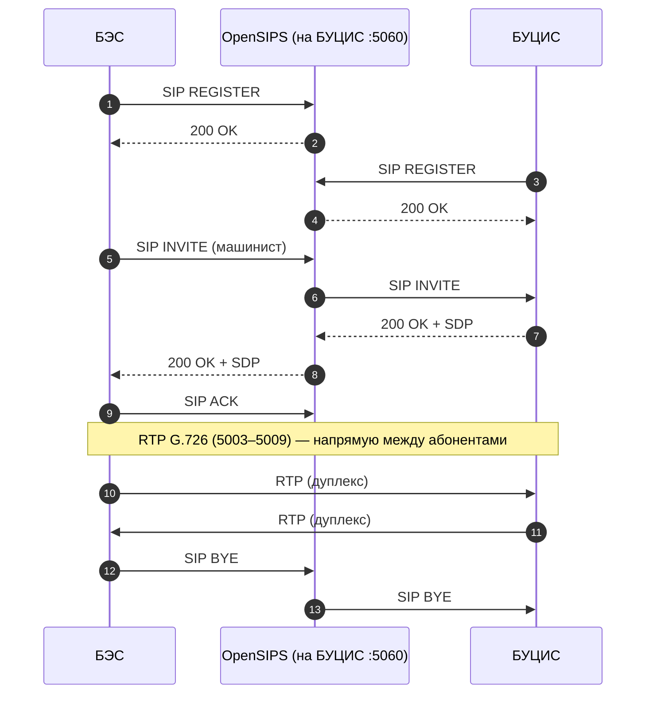
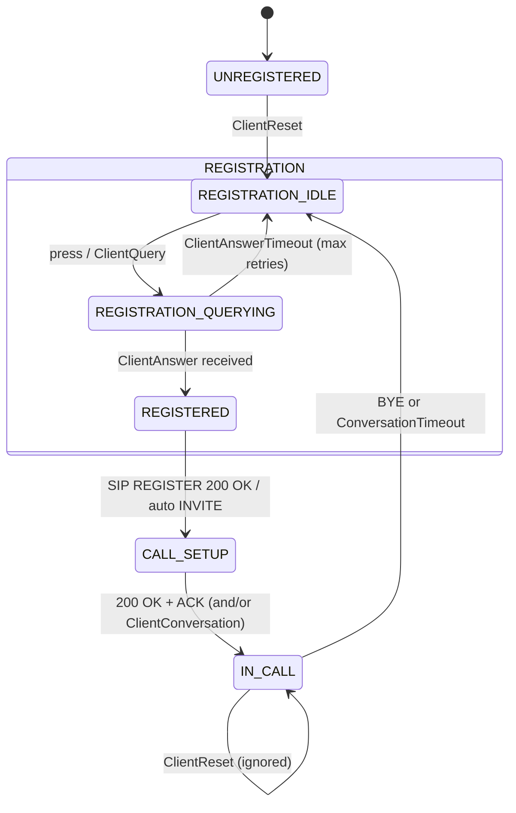

# Симулятор экстренной связи БУЦИС–БЭС (EC) по `docs/Sarmat.md`

Этот документ описывает, **что именно должен симулировать проект** в части экстренной связи **БУЦИС–БЭС** (далее **EC**), в терминах и сценариях `docs/Sarmat.md`.

Главный источник требований — `docs/Sarmat.md`.

---

## 0. Термины и сокращения

- **БУЦИС**: Блок Управления Цифровой Информационной Системой (узел управления; в симуляторе соответствует роли `bucis`).
- **БЭС**: Блок Экстренной Связи (вагонный абонент, «кнопка пассажира», LED-индикация).
- **EC**: прикладной протокол регистрации/keepalive/сигналов разговора между БУЦИС и БЭС поверх UDP (порты 8890 и 6710).
- **SIP**: сигнализация вызова (REGISTER/INVITE/BYE), порт 5060/UDP.
- **RTP**: медиа (аудио), порты 5003–5009/UDP, кодек G.726.
- **OpenSIPS**: SIP сервер в составе; **в этом симуляторе** считается, что он всегда работает на единственной голове (`bucis`) и не мигрирует.

Ссылки на `docs/Sarmat.md` далее указываются как «см. раздел X.Y».

---

## 1. Цель симулятора

Изначально проект репозитория был ориентирован на другой контур (не EC).

Для превращения проекта в **симулятор экстренной связи БУЦИС–БЭС** необходимо сфокусироваться на функциональном контуре EC:

- **EC UDP протокол** между БУЦИС и БЭС: регистрация БЭС, keepalive, сигнал о разговоре (см. `docs/Sarmat.md`, раздел **10.5**, а также описание БЭС в разделе **5**).
- **SIP/RTP голосовая подсистема**: установление и поддержание дуплексной голосовой связи (см. разделы **10.1** и **10.2**, а также общую схему **2.3**).

### 1.0.1. Принятые решения для MVP (фиксируем как часть ТЗ симулятора)

- **MVP включает реальный SIP+RTP**: SIP сигнализация через внешний OpenSIPS и реальный двусторонний RTP (G.726) в соответствии с `docs/` (см. **10.1** и **10.2** в `docs/Sarmat.md`).
- **Запуск двумя отдельными инстансами/бинарями**:
  - `bucis` запускается на Linux;
  - `bes` в MVP запускается на Linux (чтобы отладить сеть/SIP/RTP); сборка под Windows `.exe` — отдельная задача позже.
- **Триггер “кнопка нажата” на `bes`**: основной внешний ввод — **CLI-команда** (интерактивная или одноразовая — зависит от реализации, но управляется с CLI).
- **Порт `ClientQuery`**: `bucis` слушает **оба порта** — `6710/UDP` и `7777/UDP` (dual-listen) для совместимости с рассогласованием в документах.
- **Назначение `sipId`**: допускается **авто-генерация на лету** на стороне `bucis` при обработке `ClientQuery`.
- **SIP стек**: поднимается **внешний OpenSIPS**, а в симуляторе реализуются SIP клиенты поверх **`emiago/sipgo`** (UDP/5060).
- **Запуск сценариев**: достаточно логики “по таймеру при старте” (например, `bucis` периодически шлёт `ClientReset` и `KeepAlive` без внешнего API управления).
- **Метрики старого контура** (`get_metrics`, `METRICS_*`, порт 8892): **вне объёма EC-симулятора** и подлежат удалению.
- **Старый “sound” контур** (`sound_start/sound_stop`, UDP 8889, MP3-источник): **вне объёма**, остаётся только EC + SIP + RTP (G.726).
- **RTP в итерации C**: требуется не только обмен RTP-пакетами, но и **реальный вывод/воспроизведение аудио** через ALSA (где возможно).

---

## 1.1. Что уже реализовано в текущем репозитории (полезно для EC-симулятора)

Ниже перечислено то, что **фактически уже есть в коде** и может быть переиспользовано/адаптировано для EC (экстренной связи).

### 1.1.1. Запускаемые роли и параметры (CLI + `.env`)

В проекте уже есть запускаемые роли:

- **`cmd/bucis/main.go`** — роль БУЦИС (EC + SIP):
  - слушает `6710/UDP` и `7777/UDP` для `ec_client_query`
  - шлёт `ec_client_reset` и `ec_server_keepalive` на `8890/UDP`
  - отвечает `ec_client_answer` на `8890/UDP`
  - принимает SIP INVITE (через OpenSIPS), отвечает `200 OK` + SDP и после ACK шлёт `ec_client_conversation <sipId>;`

- **`cmd/bes/main.go`** — роль БЭС (EC + SIP):
  - слушает `8890/UDP`
  - по `press` шлёт `ec_client_query` на `bucis:6710`
  - после `ec_client_answer` делает SIP REGISTER и SIP INVITE на БУЦИС
  - ждёт `ec_client_conversation <sipId>;` как подтверждение разговора (останов таймера ожидания)

Текущие переменные окружения в `.env` (см. `internal/infra/config/config.go`):

- **EC**:
  - `EC_LISTEN_PORT_8890` (default `8890`)
  - `EC_BUCIS_QUERY_PORT_6710` (default `6710`)
  - `EC_BUCIS_QUERY_PORT_7777` (default `7777`)
  - `EC_BUCIS_ADDR` (default `127.0.0.1`)
  - `EC_BES_BROADCAST_ADDR` (default `192.168.5.255`)
  - `EC_BES_ADDR` (unicast override)
  - `EC_CLIENT_RESET_INTERVAL` (default `5s`)
  - `EC_KEEPALIVE_INTERVAL` (default `2s`)
  - `EC_CLIENT_ANSWER_TIMEOUT` (default `3s`)
  - `EC_CLIENT_QUERY_RETRY_INTERVAL` (default `1s`)
  - `EC_CLIENT_QUERY_MAX_RETRIES` (default `3`)
  - `EC_CALL_SETUP_TIMEOUT` (default `15s`)
  - `EC_MAC` (optional override MAC detection on `bes`)
- **SIP** (используются напрямую из окружения):
  - `SIP_USER_BUCIS`, `SIP_PASS_BUCIS`
  - `SIP_USER_BES`, `SIP_PASS_BES` (если `SIP_USER_BES` не задан, используется `bes_<sipId>`)
  - `SIP_PORT` (default `5060`)
- **RTP**:
  - `RTP_PORT_RANGE` (default `5003-5009`)
  - `RTP_G726_PT` (default `2`, допускает `96..127`)
  - `ALSA_DEVICE` (default `default`; `null` отключает ввод/вывод)
  - `NO_AUDIO=1` (отключает ввод/вывод, RTP при этом продолжает работать)

Для EC-симулятора это важно как «готовая инфраструктура конфигурирования» (CLI+env) и как пример того, как проект уже параметризует сеть/порты.

### 1.1.2. Строгий парсинг UDP-пакетов (как подход)

В репозитории уже есть пример строгого парсинга UDP-команд и тестов. Для EC важно сохранить этот стиль: чёткие форматы пакетов, валидация полей, тесты на парсер/форматтер.

### 1.1.3. Планировщик по абсолютному \(t0\) и управление сессией

Сейчас в проекте есть готовые компоненты, которые напрямую пригодятся для EC, где есть таймеры и «текущая сессия»:

- `internal/control/scheduler/scheduler.go`: планирование выполнения функции на момент \(t0\)
- `internal/session/state.go`: хранение `sessionID`, \(t0\), замена/остановка сессий, защита от гонок (`generation`)

В EC это пригодится для:

- таймеров регистрации/повторных попыток,
- таймера «ожидание ответа/разговора» на стороне `bes`,
- контроля «текущая сессия разговора по sipId».

### 1.1.4. RTP пакетизация, G.726 и метрики (loss/jitter)

В проекте уже есть реальный RTP+G.726 контур:

- **RTP**:
  - `internal/media/rtp/rtp.go`: создание RTP пакетов (pion/rtp), константы 8 kHz / 20 ms / 160 сэмплов, payload type по `RTP_G726_PT`
  - `internal/media/sender/sender.go`: стрим RTP кадров строго по таймингу 20 ms, старт в момент \(t0\)
  - `internal/media/receiver/receiver.go`: приём RTP, фильтр по payload type, подсчёт `expected/lost` и `jitter`

- **G.726**:
  - `internal/media/g726/g726.go`: encoder/decoder 32 kbit/s (4 бита/сэмпл), упаковка: **младший nibble — первый сэмпл**, старший — второй

- **Метрики**:
  - реализованы в текущем репозитории для старого контура (не EC)

Для EC-симулятора это ценно, потому что по `docs/Sarmat.md` голос — RTP/G.726, и текущий код уже умеет:

- гонять RTP пакеты,
- кодировать/декодировать G.726,
- считать потери и джиттер,
- по таймауту завершать сессию при отсутствии RTP (в текущей реализации — порядка 1 секунды).

### 1.1.5. Что в репозитории пока не реализовано для EC (важно фиксировать как “дельту”)

По содержимому `cmd/*` и `internal/*` видно, что **уже реализовано**:

- EC UDP пакеты **ClientReset/ClientQuery/ClientAnswer/KeepAlive/ClientConversation** на портах **8890** и **6710/7777**
- SIP сигнализация на **5060/UDP** (REGISTER/INVITE/200/ACK/BYE) через внешний OpenSIPS
- RTP порты выбираются из диапазона **5003–5009** и пробрасываются через SDP (через локальный форк `sipgox`), RTP идёт напрямую между абонентами

Оставшаяся дельта относительно полного описания в плане — стабилизация/документация ручного прогона под вашу сетевую схему.

### 1.1.6. Метрики в текущем проекте

В текущем коде есть legacy-обмен метриками по UDP (`get_metrics`, `METRICS_*`, порт 8892). В рамках EC-симулятора этот функционал **вне объёма** и подлежит удалению, чтобы не смешивать старый контур с EC/SIP/RTP.

### 1.1.7. Исключение из объёма: синхронный звук

Контур синхронного звука (`sound_start/sound_stop`, UDP 8889) **не входит** в целевой объём EC-симулятора и не должен сохраняться как часть требований/архитектуры.

---

## 2. Место EC в системе «Сармат»

По `docs/Sarmat.md` (см. **1** и **2**) все блоки в составе подключены к единой сети:

- Подсеть поезда: **192.168.5.0/24**
- Broadcast: **192.168.5.255** (см. IP-таблицу в **2.3**)

EC (экстренная связь) — это:

- **Регистрация** БЭС в составе и выдача ему SIP-параметров/адреса активного SIP-узла.
 - **Поддержание связи** с SIP-узлом через keepalive.
- **Фиксация факта разговора/событий** по EC каналу (например, останов таймера на БЭС по `ClientConversation`).

Голос как таковой идёт по:

- SIP сигнализации (5060/UDP)
- RTP медиа (5003–5009/UDP), кодек G.726

EC и SIP/RTP тесно связаны: EC выдаёт и актуализирует параметры, а SIP/RTP реализует непосредственно разговор.

---

## 3. Роли симулируемых узлов

Для EC-симулятора нужны минимум две роли.

### 3.1. `bucis` (сервер/узел управления)

Назначение в симуляции:

- Эмулировать логику БУЦИС как управляющего узла EC:
  - инициировать процедуру регистрации БЭС (послать `ClientReset`)
  - принимать запрос регистрации (`ClientQuery`)
  - выдавать ответ (`ClientAnswer`) с параметрами SIP
  - периодически посылать `KeepAlive` с IP активного OpenSIPS
  - посылать `ClientConversation` по событию разговора (или по иному событию, соответствующему вашей модели состояний)

Связанные требования из `docs/Sarmat.md`:

- Порты БУЦИС и назначение (см. **3**, таблица UDP портов).
- EC протокол (см. **10.5**).
- SIP роль OpenSIPS (см. **10.1**) и взаимодействие (см. **2.3**).

### 3.2. `bes` (клиент/вагон)

Назначение в симуляции:

- Эмулировать поведение БЭС как вагонного абонента:
  - получать `ClientReset`
  - по событию «кнопка нажата» отправлять `ClientQuery` на БУЦИС
  - получать `ClientAnswer` и применять параметры (в реальной системе — формирование bind-файлов и последующий SIP REGISTER; в симуляторе — аналогично или упрощённо, но без нарушения логики)
  - получать `KeepAlive` как heartbeat от единственного SIP-узла
  - получать `ClientConversation` и останавливать таймер/фиксировать факт разговора

Связанные требования из `docs/Sarmat.md`:

- Описание БЭС (см. **5**, особенно «UDP-пакеты» и сценарий).
- EC протокол (см. **10.5**).
- Голосовая схема SIP/RTP (см. **2.3**, **10.1**, **10.2**).

### 3.3. Границы модели: резервирование (упрощаем, но форматы сохраняем)

В `docs/Sarmat.md` и `docs/BUCIS_review.md` описано резервирование: обычно есть **две головы БУЦИС** (например, `192.168.5.251` и `192.168.5.252`), а активный SIP-узел (OpenSIPS) может меняться при отказе; клиенты (включая БЭС) должны перепривязываться по `KeepAlive`.

Для EC-симулятора допускается упрощение:

- моделируем **один активный** узел `bucis` и считаем, что OpenSIPS “на нём”;
- при этом **wire-format EC пакетов сохраняем как в референсе**, в частности `ClientReset` остаётся “с двумя IP голов” (см. раздел 5.0.2). Если симулируем одну голову — второй IP задаётся конфигом (например, равен первому или `0.0.0.0`), но структура пакета не упрощается.

---

## 4. Сеть и порты (что должно быть в симуляторе)

Ниже — минимально необходимый набор взаимодействий для EC-симулятора в терминах `docs/Sarmat.md`.

### 4.1. UDP: EC-канал

- **8890/UDP**: основной EC обмен между БУЦИС и БЭС (см. **10.5**, а также таблицу UDP пакетов в разделе **5**):
  - `ClientReset` (БУЦИС → БЭС)
  - `ClientAnswer` (БУЦИС → БЭС)
  - `KeepAlive` (БУЦИС → БЭС)
  - `ClientConversation` (БУЦИС → БЭС)

- **6710/UDP**: запрос регистрации от БЭС к БУЦИС — `ClientQuery` (см. **10.5** и `docs/BUCIS-BES_interaction.md`).

### 4.2. SIP: сигнализация

- **5060/UDP**: SIP REGISTER/INVITE/BYE (см. **10.1**).
- В реальной системе OpenSIPS медиа не проксирует: RTP идёт напрямую между абонентами по адресам/портам из SDP (см. **10.1** и схему **2.3**).

В этом симуляторе (MVP) принято:

- SIP делаем **реальным**: поднимается **внешний OpenSIPS**, а `bes` (и при необходимости `bucis`) реализуют SIP клиент.

### 4.3. RTP: медиа

- **5003–5009/UDP**: RTP аудио, кодек G.726 (см. **10.2**, а также сводную таблицу портов в **7**).

Для MVP RTP должен быть **реальным двусторонним** обменом (как в `docs/`), чтобы симулятор действительно проверял голосовой контур, а не только EC/сигнализацию.

### 4.4. Конкретизация по `docs/BUCIS-BES_interaction.md` (что именно и куда шлём)

`docs/BUCIS-BES_interaction.md` фиксирует порты и направления обмена между БУЦИС и БЭС.

#### 4.4.1. EC UDP: порты и пакеты

| Порт | Протокол | Назначение                                            |
| ---: | -------- | ----------------------------------------------------- |
| 6710 | UDP      | Запрос регистрации от БЭС к БУЦИС (`ClientQuery`)     |
| 8890 | UDP      | Регистрация/keepalive/события разговора (БУЦИС ↔ БЭС) |

| Пакет                |     Порт | Направление | Назначение                                                  |
| -------------------- | -------: | ----------- | ----------------------------------------------------------- |
| `ClientReset`        | 8890/UDP | БУЦИС → БЭС | Старт регистрации (IP_BUCIS1, IP_BUCIS2) |
| `ClientQuery`        | 6710/UDP | БЭС → БУЦИС | Запрос регистрации (MAC + факт нажатия)                     |
| `ClientAnswer`       | 8890/UDP | БУЦИС → БЭС | Ответ регистрации: `sipId`, `newIp`                         |
| `KeepAlive`          | 8890/UDP | БУЦИС → БЭС | Heartbeat: IP активного SIP-сервера                         |
| `ClientConversation` | 8890/UDP | БУЦИС → БЭС | Подтверждение разговора/останов таймера ожидания по `sipId`  |

Примечания:

- Для EC-симулятора фиксируем адресацию “как в поезде”:
  - `ClientReset` и `KeepAlive` — **broadcast по умолчанию** (например, `192.168.5.255:8890`), т.к. БУЦИС не знает адреса всех БЭС до первого `ClientQuery`.
  - `ClientAnswer` и `ClientConversation` — **unicast** на IP БЭС (адрес отправителя `ClientQuery`), с возможностью override для локальной отладки.
- По `docs/Sarmat.md` существует **рассогласование порта** приёмника `ClientQuery` на стороне БУЦИС: в одном месте встречается `6710`, в другом — `7777` (`Manager/proto.h` vs `UdpHandler/proto.h`). Для MVP `bucis` должен **слушать оба порта** (`6710` и `7777`) и принимать `ClientQuery` на любом из них.

#### 4.4.2. Последовательности (как должно выглядеть “на проводе”)

Регистрация БЭС:

KeepAlive (обновление IP SIP-сервера):

Голос (SIP/RTP):

|      Порт | Протокол | Назначение                         |
| --------: | -------- | ---------------------------------- |
|      5060 | SIP/UDP  | Сигнализация (REGISTER/INVITE/BYE) |
| 5003–5009 | RTP/UDP  | Аудио (G.726), дуплекс             |

Сценарий вызова «пассажир → машинист»:

#### 4.4.3. SIP `*.bind` как часть сценариев (по `docs/Sarmat.md`)

В реальной системе применение `ClientAnswer/KeepAlive` завязано на bind-файлы (`/opt/sarmat/*.bind`), и это важно отразить в симуляторе хотя бы как модель данных.

**Назначение**: bind-файл — INI с SIP-параметрами (секция `[SIP]`), активный bind выбирается по IP из `KeepAlive` (актуальный `DOMAIN`).

**Поля** (по `docs/Sarmat.md`, 10.10):

| Поле                                 | Содержимое                                                              |
| ------------------------------------ | ----------------------------------------------------------------------- |
| `DOMAIN`                             | IP OpenSIPS (в этом симуляторе: IP узла `bucis`) |
| `USER`                               | SIP-логин блока                                                         |
| `URI`                                | SIP URI абонента (`sip:user@domain`)                                    |
| `DEST_IP`                            | IP назначения при звонке                                                |
| `DEST`                               | SIP URI назначения                                                      |
| `PROXY`                              | IP прокси (совпадает с `DOMAIN`)                                        |
| `PORT_SIP`                           | 5060                                                                    |
| `PORT_RTP` / `portDRtp` / `portSRtp` | порты RTP приёма/передачи (например 5003–5009)                          |
| `PORT_REC1` / `PORT_REC2`            | порты записи разговора (если используются)                              |

**Жизненный цикл** (по `docs/Sarmat.md`):

- при первичной регистрации: `ClientAnswer (sipId, newIp)` → создание/обновление bind-файла для направления;
- (в реальной системе) при смене IP в `KeepAlive`: перевыбор актуального bind-файла → перезапуск SIP-клиента и повторный REGISTER. В этом симуляторе смена IP не моделируется.

---

## 5. EC: прикладные пакеты и их смысл

В `docs/Sarmat.md` EC описан как набор структурированных пакетов поверх UDP (см. **10.5**, и таблицу «UDP-пакеты» в **5**).

Ниже — смысл каждого пакета в контексте симулятора.

### 5.0. Форматы EC-пакетов (wire format) и тайминги

`docs/BUCIS-BES_interaction.md` задаёт **набор пакетов, направления и порты**, но **не содержит**:

- точного wire-format пакетов (`ClientReset/Query/Answer/KeepAlive/ClientConversation`) на уровне байт/полей;
- точных значений таймеров/интервалов (везде используется «каждые N секунд»).

`docs/Sarmat.md` (раздел **10.5**) уточняет смысл пакетов и их поля на уровне “что внутри” (`MAC`, `sipId/newIp`, `opensipsIp`). Ниже — фактический wire-format из материалов/референса.

Ниже — фактический wire-format, извлечённый из копий исходников BES/BUCIS (`files/BES/UdpHandler/*`, `files/BUCIS/cmdhandler_775.*`).

#### 5.0.1. Общий формат (EC UDP 8890/6710)

- **Кодировка**: UTF-8 текст.
- **Разделитель командной части**: один пробел между `cmd` и `payload`.
- **Разделитель полей внутри payload**: `;` (точка с запятой).
- **Общее правило**: пакеты на 8890 парсятся как `"<cmd> <payload>"`, где payload часто заканчивается `;` (в коде в основном ищется первый и второй `;`).

#### 5.0.2. `ClientReset` (БУЦИС → БЭС, 8890)

- **cmd**: `ec_client_reset`
- **payload**: `<ip_head1>;<ip_head2>;`
- **пример**: `ec_client_reset 192.168.5.251;192.168.5.252;`

Поля:

- `<ip_head1>`: IP первой головы БУЦИС (типично `192.168.5.251`)
- `<ip_head2>`: IP второй головы БУЦИС (типично `192.168.5.252`)

#### 5.0.3. `ClientAnswer` (БУЦИС → БЭС, 8890)

- **cmd**: `ec_client_answer`
- **payload**: `<newIp>;<sipId>;`
- **пример**: `ec_client_answer 192.168.5.251;1234;`

Поля:

- `<newIp>`: IP OpenSIPS/домена, который должен попасть в bind-конфиг (строка IPv4)
- `<sipId>`: идентификатор абонента БЭС (строка/число, зависит от реализации)

#### 5.0.4. `KeepAlive` (БУЦИС → БЭС, 8890)

- **cmd**: `ec_server_keepalive`
- **payload**: `<opensipsIp>;<status>;`
- **пример**: `ec_server_keepalive 192.168.5.251;0;`

Поля:

- `<opensipsIp>`: IP активного OpenSIPS (IPv4)
- `<status>`: строка/число статуса (по материалам референса: `0` — штатно, `1` — рестарт)

Примечание:

- для корректного разбора в референсном БЭС полезно всегда отправлять строку в виде `...;<status>;` (с завершающим `;`).

#### 5.0.5. `ClientConversation` (БУЦИС → БЭС, 8890)

- **cmd**: `ec_client_conversation`
- **payload**: `<sipId>;`
- **пример**: `ec_client_conversation 1234;`

#### 5.0.6. `ClientQuery` (БЭС → БУЦИС, 6710 или 7777)

Формат запроса на стороне БЭС формируется как:

- **cmd**: `ec_client_query`
- **payload**: `<mac>`
- **пример**: `ec_client_query AA:BB:CC:DD:EE:FF`

Поля:

- `<mac>`: MAC-адрес БЭС в строковом виде с двоеточиями (как возвращает `QNetworkInterface::hardwareAddress()`).

Примечание:

- по референсу БЭС (`UdpHandler`) формирует `ec_client_query <MAC>` **без завершающего `;`** и **без доп. полей** после MAC.

Поэтому для реализации симулятора:

- **Семантика/поля** пакетов берутся из `docs/Sarmat.md` **10.5** и сценариев в документе.
- **Таймеры** должны быть оформлены как конфиг с явными значениями по умолчанию, чтобы сценарии были воспроизводимы (даже если исходная система использует “N секунд”).

### 5.1. `ClientReset` (БУЦИС → БЭС, порт 8890)

Назначение:

- Запустить процедуру регистрации БЭС.
- Передать БЭС IP голов (в документах: IP_BUCIS1, IP_BUCIS2), чтобы БЭС мог выбрать/переключиться на активную.
- В симуляторе резервирование можно не моделировать, но формат пакета остаётся “две головы”.

Симулятор должен:

- на стороне `bucis`: иметь действие «инициировать регистрацию» (периодически, или по запросу, или при старте).
- на стороне `bes`: при получении reset перейти в состояние «ожидаю/выполняю регистрацию».

### 5.2. `ClientQuery` (БЭС → БУЦИС, порт 6710)

Назначение:

- Запросить регистрацию, передав идентификатор БЭС (MAC) и факт нажатия кнопки (см. **10.5**).

Симулятор должен:

- иметь управляемое событие «нажатие кнопки», основной внешний ввод — **CLI-команда**.
- на стороне `bes`: отправлять `ClientQuery` на порт назначения **6710/UDP** (при необходимости допускается отправка и на `7777/UDP`, но MVP-совместимость достигается dual-listen на стороне `bucis`).
- на стороне `bucis`: принимать запрос и формировать `ClientAnswer`.

### 5.3. `ClientAnswer` (БУЦИС → БЭС, порт 8890)

Назначение:

- Передать данные, необходимые для SIP: `sipId` и `newIp` (см. **10.5**).
- В реальной системе эти данные используются для формирования bind-файлов и выполнения SIP REGISTER (см. **10.10**, где описан жизненный цикл bind-файлов).

Симулятор должен:

- на стороне `bucis`: генерировать/назначать `sipId` и адрес SIP узла (адрес OpenSIPS).
- на стороне `bes`: применить ответ:
  - сохранить `sipId`
  - выбрать текущий SIP домен/IP
  - инициировать SIP REGISTER (реальный или симулированный)

### 5.4. `KeepAlive` (БУЦИС → БЭС, порт 8890)

Назначение:

- Периодически сообщать **IP текущего активного OpenSIPS** (см. **10.5**, **8.2**).
- В реальной системе при изменении IP БЭС должен перепривязать SIP (перечитать bind и перезапустить телефонный компонент).

Симулятор должен:

- на стороне `bucis`: периодически слать keepalive с IP SIP-узла (IP `bucis`).
- на стороне `bes`: принимать keepalive как heartbeat (без сценария смены IP в рамках этого симулятора).

### 5.5. `ClientConversation` (БУЦИС → БЭС, порт 8890)

Назначение:

- Несёт `sipId` и используется БЭС как **`stopTimer(sipId)`**: остановить аварийный таймер ожидания установления вызова (CallSetupTimeout) и зафиксировать, что вызов принят/разговор состоялся.
- Этот пакет отправляется **после установления вызова** (после SIP `200 OK`/`ACK`, т.е. когда вызов перешёл в `ANSWERED`), а **не после BYE**.

Симулятор должен:

- иметь событие «вызов принят/разговор подтверждён» и отправлять `ClientConversation`.
- на стороне `bes`: по `sipId` перевести состояние из «жду установления/звоню» в «в разговоре (таймер остановлен)».

---

## 6. Голосовая подсистема: SIP/RTP (что симулировать)

Согласно `docs/Sarmat.md`:

- SIP используется для сигнализации (см. **10.1**).
- RTP используется для медиа (см. **10.2**).
- OpenSIPS медиа не проксирует: RTP идёт напрямую между абонентами (см. **10.1** и схему **2.3**).

### 6.1. Минимально жизнеспособная симуляция

Чтобы симулятор был полезен для проверки EC:

- **SIP**: достаточно верифицировать, что после `ClientAnswer` БЭС может зарегистрироваться на указанный SIP узел и инициировать/принять звонок.
- **RTP**: поднять двусторонний обмен RTP (G.726) напрямую по SDP, и в рамках MVP обеспечить **реальный вывод/воспроизведение** декодированного аудио через ALSA (потери/джиттер можно логировать как диагностику).

Если RTP не реализован, это нужно честно описать как ограничение симулятора.

### 6.2. Порты RTP

По `docs/Sarmat.md` используются порты диапазона **5003–5009** (см. **7** и **10.2**).

Для симулятора рекомендуется:

- позволить задавать конкретные порты и/или диапазон,
- не использовать «один fixed порт 5006», т.к. EC голосовая связь описана как RTP диапазон 5003–5009.

---

## 7. Сценарии, которые должен покрывать симулятор

Этот раздел — «что мы должны уметь прогонять» на симуляторе, чтобы он соответствовал `docs/Sarmat.md`.

### 7.1. Регистрация БЭС (основной сценарий)

Сценарий (см. `docs/Sarmat.md` **8.2**, «Регистрация БЭС в составе»):

1. **БУЦИС → БЭС**: `ClientReset` (8890) с IP узла `bucis`.
2. **Событие на БЭС**: «нажата кнопка пассажира».
3. **БЭС → БУЦИС**: `ClientQuery` (6710) с MAC/идентификатором.
4. **БУЦИС → БЭС**: `ClientAnswer` (8890) с `sipId` и `newIp`.
5. **БЭС**: применяет параметры и делает SIP REGISTER на OpenSIPS (5060).

Ожидаемые признаки успешности:

- БЭС перешёл в состояние «зарегистрирован».
- SIP регистрация подтверждена (если SIP реальный).

### 7.2. Установка экстренного вызова (пассажир → машинист)

По `docs/Sarmat.md` (см. **2.3** и **10.1/10.2**):

1. БЭС инициирует SIP INVITE на цель (машинист).
2. После 200 OK + SDP начинается RTP обмен напрямую.
3. БУЦИС может послать `ClientConversation` (8890), чтобы БЭС остановил свой таймер и зафиксировал разговор.

Нормативная фиксация (чтобы не было развилок сценария):

- Событие `press` на БЭС относится к EC (инициирует `ClientQuery`).
- SIP INVITE отправляется БЭС **автоматически сразу после успешного REGISTER** (после получения `200 OK` на REGISTER), без дополнительного `press`.

Ожидаемые признаки:

- SIP сессия установлена.
- RTP пакеты ходят в обе стороны (если реализовано).
- Логи/метрики фиксируют состояние «в разговоре».

### 7.3. KeepAlive как heartbeat (один `bucis`)

В `docs/Sarmat.md` `KeepAlive` используется в разных сценариях. В этом симуляторе `KeepAlive` используется только как heartbeat-обмен.

Сценарий:

1. `bucis` периодически шлёт `KeepAlive` с IP OpenSIPS (IP `bucis`).
2. `bes` принимает keepalive и ведёт состояние “связь с головой есть/нет” (в рамках выбранной модели таймаутов).

### 7.4. Таймеры/ошибочные сценарии (по минимуму)

В `docs/Sarmat.md` показано, что на БЭС есть таймеры и состояния (см. **5**, диаграмма конечного автомата).

Для симулятора полезно иметь проверки:

- «не пришёл `ClientAnswer`» — БЭС остаётся в регистрации/повторяет попытки (как у вас задумано).
- «нет keepalive» — БЭС помечает SIP как потерянный и ждёт восстановления (опционально).
- «повторный `press` во время активного звонка» (MVP): БЭС блокирует кнопку в состояниях `CALLING/IN_CALL` и не отправляет `ClientQuery`; если дубль всё же пришёл на `bucis` — `bucis` логирует и игнорирует.

Дополнение (фиксируем поведение на исчерпании ретраев):

- «исчерпаны ретраи `ClientQueryMaxRetries` без ответа» — это завершает только текущую попытку (один press-цикл): БЭС возвращается в `REGISTRATION` в “idle”-подсостояние и ждёт следующего `press` (не откатывается в `UNREGISTERED`).

---

## 8. Чек-лист требований к EC-симулятору

Этот раздел — практический список «что должно быть реализовано/смоделировано», чтобы симулятор соответствовал поведению из `docs/Sarmat.md`.

### 8.1. Роли и состояния

- **Роль `bucis`**:
  - умеет инициировать регистрацию `ClientReset`
  - принимает `ClientQuery` и отвечает `ClientAnswer`
  - периодически отправляет `KeepAlive`
  - по событию разговора отправляет `ClientConversation`
- **Роль `bes`**:
  - на `ClientReset` переходит в режим регистрации
  - по событию «нажата кнопка» отправляет `ClientQuery`
  - на `ClientAnswer` применяет параметры SIP (sipId + адрес SIP узла)
  - реагирует на `KeepAlive` как на heartbeat _(out of scope MVP: смена IP в KeepAlive и автоматическое переподключение)_
  - учитывает `ClientConversation` для таймера/состояния разговора

### 8.2. Сеть и порты

- **EC**:
  - UDP 8890: `ClientReset`, `ClientAnswer`, `KeepAlive`, `ClientConversation`
  - UDP 6710: `ClientQuery` (как в `docs/BUCIS-BES_interaction.md`)
- **SIP**:
  - UDP 5060: REGISTER/INVITE/ACK/BYE (реально, как в `docs/Sarmat.md`)
- **RTP**:
  - UDP 5003–5009: двусторонний обмен RTP, кодек G.726 (реально, как в `docs/Sarmat.md`)

### 8.3. Обязательные сценарии

- **Регистрация БЭС**: ClientReset → (button) ClientQuery → ClientAnswer → SIP REGISTER
- **Экстренный вызов**: SIP INVITE/200/ACK/BYE → RTP (дуплекс, G.726) → ClientConversation
- **KeepAlive heartbeat**: периодический `KeepAlive` и реакция `bes` на его отсутствие/наличие

### 8.4. Границы симуляции (должны быть описаны явно)

- Если SIP/RTP реализованы не полностью, это фиксируется как ограничение (что именно имитируется и как это влияет на сценарии).
- Контур синхронного звука (UDP 8889, `sound_start/sound_stop`) **не входит в объём** этого симулятора.
-
- **KeepAlive: переподключение/перерегистрация по смене IP**: _(out of scope MVP)_. В MVP `KeepAlive` — только heartbeat: если `opensipsIp != 0.0.0.0` — обновляем `lastKeepaliveAt` и логируем `"keepalive from <ip>, status=<s>"`. Никаких SIP re-REGISTER/смены домена по KeepAlive в MVP нет.
- **SIP re-REGISTER по expiry**: _(out of scope MVP)_. Симулятор делает одну регистрацию при старте и не поддерживает периодический re-REGISTER. Рекомендуемая настройка OpenSIPS для dev: большой expiry (например, 3600s и выше).
- **ALSA в CI/без звука**: поддерживается режим `ALSA_DEVICE=null` или `NO_AUDIO=1` — RTP принимается, G.726 декодируется, вывод — в `null` sink; метрики (lost/jitter) продолжают считаться.

---

## 8.5. Ответы на вопросы “что именно делать” по `docs/` (нормативная интерпретация)

Ниже зафиксированы ответы на ключевые вопросы о “переделке проекта”, **строго по документам** в `docs/` (в первую очередь `docs/Sarmat.md`, `docs/BUCIS-BES_interaction.md`, `docs/BUCIS_review.md`). Это нужно, чтобы цели симулятора не «уплывали» в сторону и чтобы заранее было понятно, что считается соответствием документации.

### 8.5.1. Какой минимальный объём (MVP) “по документации”

По `docs/Sarmat.md` экстренная связь БЭС — это **связка**:

- **EC UDP** (регистрация/keepalive/события) на портах **8890/UDP** и **6710/UDP** (см. `docs/Sarmat.md`, **10.5**; `docs/BUCIS-BES_interaction.md`);
- **SIP сигнализация** на **5060/UDP** (см. `docs/Sarmat.md`, **10.1**);
- **RTP медиа** на портах **5003–5009/UDP**, кодек **G.726**, **дуплекс** (см. `docs/Sarmat.md`, **10.2**).

То есть “MVP как в системе” — это не только EC-пакеты, но и наличие SIP/RTP контура, иначе симуляция перестаёт проверять основную полезную функцию БЭС: **экстренный голосовой вызов**.

### 8.5.2. SIP: реальный или можно симулировать

Документация описывает конкретную реализацию и методы SIP:

- методы: **REGISTER / INVITE / ACK / BYE**;
- сервер: **OpenSIPS**;
- транспорт: **UDP 5060** (см. `docs/Sarmat.md`, **10.1**).

Следовательно, если цель — соответствовать `docs/`, SIP должен быть **реальным**, а не “фейковыми событиями” внутри логики.

### 8.5.3. RTP: реальный или можно заглушить

Документация фиксирует, что:

- RTP идёт по **5003–5009/UDP**, кодек **G.726** (см. `docs/Sarmat.md`, **10.2**);
- **OpenSIPS медиа не проксирует** — RTP ходит **напрямую между абонентами по SDP** (см. `docs/Sarmat.md`, **10.1–10.2**).

Следовательно, для соответствия `docs/` RTP должен быть **реальным двусторонним** обменом.

### 8.5.4. Другие блоки системы (вне объёма симулятора)

`docs/Sarmat.md` описывает и другие блоки системы помимо БУЦИС и БЭС. **В этом симуляторе они не моделируются**: реализуются только роли `bucis` и `bes`.

### 8.5.5. Порт `ClientQuery`: 6710 или 7777

В `docs/BUCIS-BES_interaction.md` для `ClientQuery` указан **6710/UDP**.

При этом в `docs/Sarmat.md` явно отмечено **рассогласование**: в одном месте встречается `6710`, в другом `7777` (см. `docs/Sarmat.md`, примечание к портам и раздел **10.5**).

Вывод для симулятора:

- **по умолчанию** используем **6710** (как в `docs/BUCIS-BES_interaction.md`);
- **совместимость с 7777** обеспечиваем тем, что `bucis` **слушает оба порта** (`6710` и `7777`) и принимает `ClientQuery` на любом из них.

### 8.5.6. Исключение из объёма: синхронный звук

`docs/Sarmat.md` описывает отдельный механизм синхронного звука (UDP 8889, `sound_start`/`sound_stop`). В этом проекте он **не реализуется** и не рассматривается.

### 8.5.7. Событие “нажатие кнопки”

В документации БЭС “нажатие кнопки” — внешний физический триггер (в исходной системе через отдельный процесс), который приводит к:

- в состоянии регистрации: отправке `ClientQuery` (см. `docs/Sarmat.md`, **8.2** и `docs/BUCIS-BES_interaction.md`).

В симуляторе этот триггер должен быть внешне управляемым (CLI/HTTP/сигнал), но семантика должна остаться: “кнопка” → `ClientQuery`.

Для MVP фиксируем: основной внешний ввод на `bes` — **CLI-команда** (управляемое “нажатие кнопки” из консоли).

### 8.5.8. Что считать “готово” (обязательные сценарии)

Минимум по `docs/`:

- **Регистрация БЭС**: `ClientReset` → (button) `ClientQuery` → `ClientAnswer` → **SIP REGISTER** (см. `docs/BUCIS-BES_interaction.md`; `docs/Sarmat.md`, **8.2**, **10.5**, **10.1**).
- **Экстренный вызов**: **SIP INVITE/200/ACK/BYE** + **RTP dуплекс G.726 (5003–5009)** (см. `docs/BUCIS-BES_interaction.md`; `docs/Sarmat.md`, **10.1–10.2**).
- **KeepAlive heartbeat**: `KeepAlive` как периодический heartbeat.

### 8.5.9. `ClientReset`: один IP или два IP голов

Документы описывают `ClientReset` как содержащий **IP двух голов** (IP_BUCIS1, IP_BUCIS2), а референсный wire-format — `ec_client_reset <ip_head1>;<ip_head2>;`.

Вывод для симулятора:

- формируем и парсим `ClientReset` **в формате двух IP**;
- если резервирование не моделируется — второй IP задаётся конфигом (например, равен первому или `0.0.0.0`), но формат пакета не упрощается.

### 8.5.10. `ClientAnswer`: порядок полей в payload

Смысл `ClientAnswer` по `docs/Sarmat.md`: ответ несёт `sipId` и `newIp`.
При этом референсный wire-format фиксирует форму `ec_client_answer <newIp>;<sipId>;`.

Вывод для симулятора:

- используем **`<newIp>;<sipId>;`** как нормативный wire-format;
- в логике трактуем значения как “`newIp` для bind/OpenSIPS” и “`sipId` абонента”.

### 8.5.11. `KeepAlive status` и завершающий `;`

Референсный формат: `ec_server_keepalive <opensipsIp>;<status>;`, где `status`: `0` — штатно, `1` — рестарт.

Вывод для симулятора:

- всегда отправляем `KeepAlive` в форме `...;<status>;` (с завершающим `;`);
- `status` делаем конфигурируемым, по умолчанию `0`.

### 8.5.12. Unicast vs broadcast в EC-диалогах

`docs/Sarmat.md` задаёт принцип: **диалоги — unicast**, но допускает “или broadcast по реализации”.

Вывод для симулятора:

- по умолчанию используем **broadcast** для пакетов “БУЦИС → все БЭС”:
  - `ClientReset` → `192.168.5.255:8890`
  - `KeepAlive` → `192.168.5.255:8890`
- используем **unicast** для пакетов “БУЦИС → конкретный БЭС”:
  - `ClientAnswer` → `src_ip(ClientQuery):8890`
  - `ClientConversation` → `bes_ip:8890`
- unicast/broadcast адреса должны быть конфигурируемыми, чтобы на одной машине можно было гонять всё через loopback.

### 8.5.13. Что в `docs/` помечено как “не определено в ТЗ (требуется уточнение)”

В `docs/BUCIS_review.md` явно зафиксировано правило: если где-то “дыра” (нет точного формата/полей/дефолтов), значит это **не определено** в имеющихся материалах и закрывается либо референсными исходниками, либо pcap-дампом трафика.

Вывод для симулятора:

- считаем нормативным wire-format из `docs/BUCIS_review.md` (как наиболее конкретный);
- любые отличия “в поле” закрываем через pcap/сверку с референсной реализацией.

---

## 8.6. Технический контракт симулятора (что должно быть “на проводе”)

Этот раздел — краткий “контракт” для реализации, без привязки к внутренней архитектуре кода (важен внешний обмен и наблюдаемое поведение).

### 8.6.1. Сокеты и порты

- **EC inbound/outbound**:
  - `bucis`: слушает **6710/UDP** (и опционально **7777/UDP**) для `ClientQuery`; шлёт/слушает **8890/UDP** для `ClientReset/ClientAnswer/KeepAlive/ClientConversation`.
  - `bes`: слушает **8890/UDP** на `0.0.0.0:8890` (обязательно, чтобы получать `ClientAnswer/ClientConversation` при loopback/unicast); шлёт `ClientQuery` на активный `bucis` (**6710/UDP**, опционально 7777).
- **SIP**:
  - SIP сервер (OpenSIPS) на активном узле: **5060/UDP**.
  - SIP клиенты: `bes` и `bucis` регистрируются на OpenSIPS и устанавливают вызов.
- **RTP**:
  - медиа — **5003–5009/UDP**, **G.726**, дуплекс, **напрямую между `bes` и `bucis`** (адреса/порты из SDP).

### 8.6.2. EC wire-format (текстовые команды)

Форматы пакетов (текст, пробел между `cmd` и `payload`, `;` как разделитель полей):

- `ClientReset` (8890): `ec_client_reset <ip_head1>;<ip_head2>;`
- `ClientQuery` (6710/7777): `ec_client_query <mac>`
- `ClientAnswer` (8890): `ec_client_answer <newIp>;<sipId>;`
- `KeepAlive` (8890): `ec_server_keepalive <opensipsIp>;<status>;`
- `ClientConversation` (8890): `ec_client_conversation <sipId>;`

Примеры:

- `ec_client_reset 192.168.5.251;192.168.5.252;`
- `ec_client_query AA:BB:CC:DD:EE:FF`
- `ec_client_answer 192.168.5.251;1234;`
- `ec_server_keepalive 192.168.5.251;0;`
- `ec_client_conversation 1234;`

### 8.6.3. Наблюдаемые состояния (минимально)

- `bes`:
  - `UNREGISTERED` → после `ClientReset` → `REGISTRATION`
  - внутри `REGISTRATION` полезно держать подсостояния:
    - `IDLE` (ждём `press`)
    - `QUERYING` (послан `ClientQuery`, ждём `ClientAnswer`, считаем ретраи)
  - на “кнопку” в `REGISTRATION`: отправка `ClientQuery`
  - после `ClientAnswer`: применение `sipId/newIp` и переход к SIP REGISTER
  - после `ClientQueryMaxRetries` без ответа: `QUERYING → IDLE` (остаемся в `REGISTRATION`)
  - `KeepAlive`: heartbeat от `bucis` (в этом симуляторе IP не меняется)
  - после успешного SIP REGISTER: автоматический SIP INVITE и переход в установление вызова
  - при установке вызова: переход в `IN_CALL`
  - после SIP BYE (входящий/исходящий) или по `ConversationTimeout`: `IN_CALL → REGISTRATION/IDLE`
  - при получении `ClientReset` в состоянии `IN_CALL`: **игнорировать** (активный разговор не сбрасывать)

Рекомендуемая диаграмма состояний БЭС (нормативная для симулятора):

---

## 9. Как описывать EC-симулятор (чтобы границы были понятны)

Этот раздел не про рефакторинг кода, а про то, **как правильно описать продукт**, чтобы читатель понял границы симуляции.

### 9.1. Что симулируется “как в системе”

- EC обмен по UDP с реальными сокетами (8890/6710).
- KeepAlive как heartbeat.
- SIP/RTP на реальных портах.

### 9.2. Что может быть упрощено (но должно быть явно отмечено)

- Реальные bind-файлы `/opt/sarmat/*.bind` можно заменить на конфиг в `.env`, но в документации важно сказать, что это **аналог**.
- Реальную LED/кнопку (GPIO) заменить на CLI/сигнал, но указать соответствие «нажатие кнопки → ClientQuery».

---

## 10. Прямые ссылки на разделы `docs/Sarmat.md`, на которые опирается этот документ

- **Сеть и общая топология**: разделы **1**, **2**, IP-таблица в **2.3**
- **БЭС (назначение/пакеты/сценарии)**: раздел **5**
- **SIP**: раздел **10.1**
- **RTP**: раздел **10.2**
- **EC протокол (ClientReset/Query/Answer/KeepAlive/Conversation)**: раздел **10.5**
- **Сводная таблица портов**: раздел **7**
- **Последовательности сценариев (регистрация)**: раздел **8.2**
- (вне объёма симулятора) синхронный звук: `docs/Sarmat.md`, раздел **10.6**

---

## 11. Нормативные дефолты для реализации (чтобы MVP был воспроизводим)

Этот раздел фиксирует значения “по умолчанию”, которых нет в `docs/` (там часто “каждые N секунд”), но без которых симулятор получается неустойчивым и трудно воспроизводимым.

### 11.1. Таймеры (дефолты)

Для MVP принимаем такие дефолты (все значения — конфигурируемые):

- `ClientResetInterval`: **5s** — период отправки `ClientReset` от `bucis` к `bes`
- `KeepAliveInterval`: **2s** — период `KeepAlive` от `bucis` к `bes`
- `ClientAnswerTimeout`: **3s** — таймаут ожидания `ClientAnswer` на `bes` после “кнопки”
- `ClientQueryRetryInterval`: **1s** — интервал между повторными `ClientQuery`
- `ClientQueryMaxRetries`: **3** — число повторов `ClientQuery` (включая первую попытку)
- `SipRegisterTimeout`: **3s** — ожидание успешного REGISTER (если SIP реальный)
- `CallSetupTimeout`: **10s** — ожидание установки вызова (200 OK/ACK)
- `ConversationTimeout`: **30s** — максимальная длительность разговора (если не завершено BYE)

Если что-то из этого не нужно в текущей итерации (например, RTP ещё не включён), таймер остаётся в конфиге, но код может его не использовать.

Нормативные уточнения:

- `ClientReset` (от `bucis`) рекомендуется отправлять **сразу при старте**, и затем повторять каждые `ClientResetInterval`.
- `ConversationTimeout` запускается на стороне `bes` при входе в состояние разговора (после установки SIP-сессии и/или получения `ClientConversation` для своего `sipId`). По истечении таймаута `bes` завершает разговор (SIP BYE) и возвращается в режим ожидания в рамках регистрации.

### 11.2. Сетевые дефолты (порты и адреса)

- EC:
  - `bucis`: listen `8890/UDP`, `6710/UDP`, `7777/UDP`
  - `bes`: listen `8890/UDP`, send `ClientQuery` на `bucis:6710` (опционально — также `:7777`)
- SIP:
  - OpenSIPS: `5060/UDP` на `bucis` (в этом симуляторе — одна голова)
- RTP:
  - диапазон: **5003–5009/UDP**
  - выбор локального RTP-порта на сессию: **первый свободный в диапазоне 5003–5009** (без фиксированного “порт по умолчанию 5006”)

### 11.3. Дефолты по содержимому EC-пакетов

- `ClientReset`:
  - `ip_head1`: IP `bucis`
  - `ip_head2`: **по умолчанию равен `ip_head1`** (формат “две головы” сохраняем)
- `KeepAlive status`:
  - по умолчанию **`0`** (штатно)
  - значение конфигурируемо, но логика рестарта (status=1) в MVP может отсутствовать

### 11.4. Правило назначения `sipId`

Для воспроизводимости сценариев и удобства отладки:

- `bucis` ведёт отображение `mac -> sipId` в памяти процесса
- при первом `ClientQuery` для нового MAC назначается новый `sipId` (например, автоинкремент)
- при повторном `ClientQuery` для того же MAC выдаётся тот же `sipId`
- `sipId` в wire отправляется как **decimal integer string** (`"1"`, `"2"`, ...), не UUID/hex.

Стабильность между рестартами не требуется (если не оговорено иначе).

---

## 12. CLI и конфиг (технический интерфейс симулятора)

Цель — чтобы симулятор можно было запускать вручную и скриптами без дополнительных API.

### 12.1. Роль `bes`: “кнопка” как внешний ввод

MVP контракт:

- поддерживается одноразовый режим: `bes --press` (или аналогичный флаг), который сразу инициирует “кнопку”
- поддерживается интерактивный режим: `bes` запускается и принимает команды из stdin, минимум команда `press`

Семантика одна:

- `press` в состоянии регистрации/ожидания → отправка `ClientQuery` на активный `bucis`

### 12.2. Переменные окружения (минимальный набор для EC/SIP/RTP)

Конкретные имена можно увязать с существующим `internal/infra/config`, но смысл должен быть таким:

- **EC**:
  - `EC_BUCIS_ADDR`: адрес `bucis` для `ClientQuery` (unicast)
  - `EC_BES_BROADCAST_ADDR`: адрес назначения для `ClientReset/KeepAlive` (обычно broadcast `192.168.5.255`; в dev на одной машине допускается unicast `127.0.0.1`, либо broadcast loopback `127.255.255.255`)
  - `EC_BES_ADDR`: опциональный unicast override для `ClientReset/KeepAlive` (если задан — отправляем на него вместо broadcast)
  - `EC_LISTEN_PORT_8890`: порт слушания EC на обеих ролях (8890)
  - `EC_BUCIS_QUERY_PORT_6710`: основной порт `ClientQuery` (6710)
  - `EC_BUCIS_QUERY_PORT_7777`: дополнительный (7777)
- **SIP**:
  - `SIP_DOMAIN`: IP/host OpenSIPS (в MVP — IP `bucis`)
  - `SIP_PORT`: 5060
  - `SIP_USER_BES`, `SIP_USER_BUCIS`: логины абонентов
- **RTP**:
  - `RTP_PORT_RANGE`: `5003-5009` (или два отдельных значения min/max)
  - `RTP_G726_PT`: payload type (как в текущем репозитории)

Важно: можно переиспользовать **механизм** конфигурации из `internal/infra/config` (env + flags), но **legacy-ключи старого “sound” контура** (`CONTROL_*`, `MEDIA_PORT`, `AUDIO_FILE`, `METRICS_*`) не считаются частью целевого интерфейса EC-симулятора и будут заменены на EC/SIP/RTP ключи выше.

---

## 13. Предположения по OpenSIPS для MVP (границы ответственности симулятора)

В симуляторе:

- OpenSIPS считается “внешней зависимостью” и поднимается отдельно
- симулятор реализует SIP клиентов (`bes` и `bucis`) поверх UDP/5060

Минимальные требования к окружению для воспроизводимости:

- OpenSIPS принимает REGISTER от двух пользователей (условно `bes` и `bucis`)
- маршрутизирует INVITE от `bes` к `bucis`
- не проксирует RTP (RTP идёт напрямую по SDP)

Если в репозитории отсутствует готовый конфиг OpenSIPS, его нужно добавить как часть проекта (например, в `docs/`), иначе MVP будет трудно повторить на другой машине.

---

## 14. Итерации реализации (как делать без “большого переписывания”)

Чтобы проект оставался запускаемым на каждом шаге, предлагаем 3 итерации:

### 14.1. Итерация A: EC без SIP/RTP (только “провод” и состояния)

- `bucis`:
  - слушает `6710` и `7777`, принимает `ec_client_query <mac>`
  - шлёт `ClientReset`, `ClientAnswer`, `KeepAlive`, `ClientConversation` по `8890`
- `bes`:
  - слушает `8890`, парсит команды
  - по `press` шлёт `ClientQuery`
  - ведёт состояния регистрации/ожидания и таймеры `ClientAnswerTimeout`, ретраи `ClientQuery`

Критерий “готово”:

- в логах и на проводе видна последовательность `ClientReset → ClientQuery → ClientAnswer → KeepAlive`
- `bucis` принимает запросы с обоих портов (`6710`, `7777`)

### 14.2. Итерация B: SIP реальный, RTP ещё можно заглушить

- `bes` после `ClientAnswer` выполняет SIP REGISTER на `SIP_DOMAIN:5060`
- `bes` инициирует INVITE на “машиниста” (`bucis`)
- `bucis` принимает INVITE и отвечает 200 OK + SDP (минимально достаточное)

Критерий “готово”:

- REGISTER подтверждается
- INVITE устанавливается до ACK

### 14.3. Итерация C: RTP дуплекс G.726 на 5003–5009

- после установки вызова обе стороны стартуют RTP отправку/приём по портам из SDP
- кодек — G.726, packetization 20ms как в текущем репозитории

Критерий “готово”:

- RTP пакеты идут в обе стороны
- декодированный G.726 поток **реально воспроизводится** (ALSA) хотя бы на одной стороне (минимум — на `bes`)
- дополнительно (как диагностика) есть базовые метрики: received/expected/lost/jitter

---

## 15. Минимальный ручной прогон (как проверять MVP)

Цель — простая инструкция “что увидеть”, без внешних тестовых фреймворков.

### 15.1. EC

- запустить `bucis` с включёнными сокетами `8890`, `6710`, `7777`
- запустить `bes` и убедиться, что он принимает `ClientReset` и `KeepAlive`
- выполнить “кнопку” на `bes` (`press`) и увидеть:
  - `bes` отправил `ec_client_query <MAC>`
  - `bucis` ответил `ec_client_answer <newIp>;<sipId>;`

### 15.2. SIP

- поднять OpenSIPS
- убедиться, что `bes` делает REGISTER после `ClientAnswer`
- выполнить вызов и убедиться, что установление доходит до ACK

### 15.3. RTP

- убедиться, что RTP порты попали в SDP
- убедиться, что RTP идёт в обе стороны
- убедиться, что есть **реальное воспроизведение** аудио (ALSA) и/или логи декодирования, и метрики меняются
