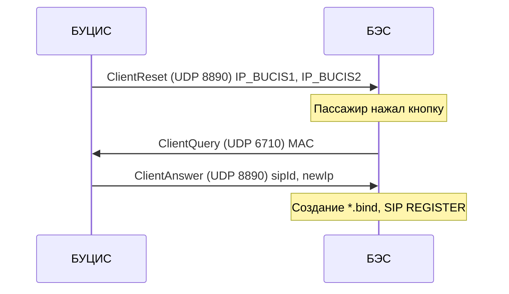
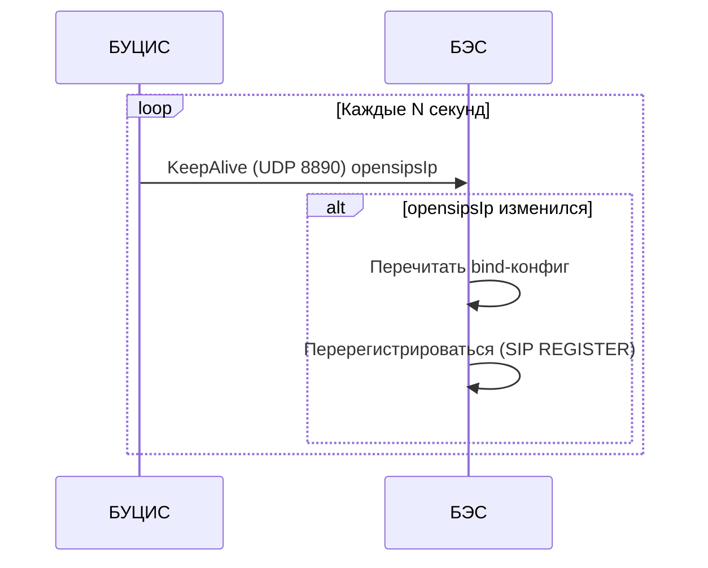
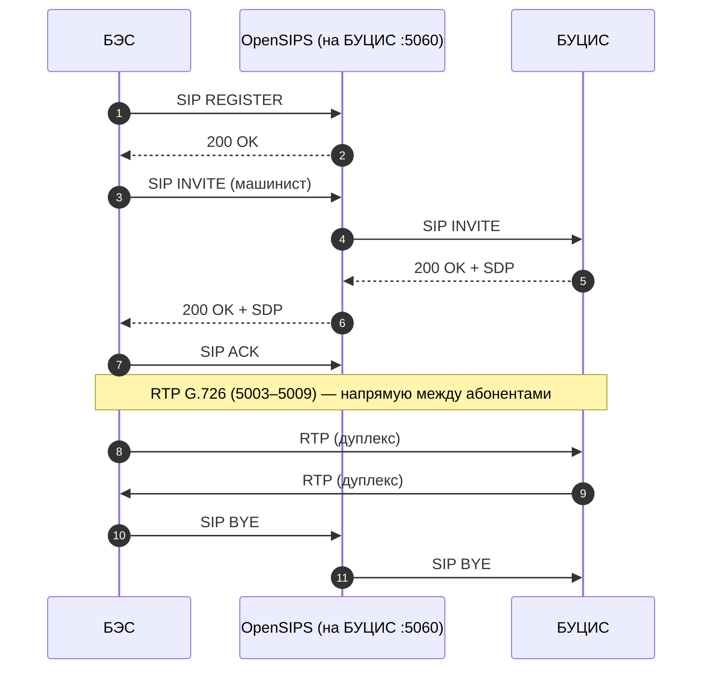

# Взаимодействие БУЦИС ↔ БЭС (Сармат)

Документ описывает **только** обмен между:

- **БУЦИС** — головной блок управления (кабина машиниста)
- **БЭС** — блок экстренной связи в вагоне (кнопка/индикация + голос)

## Сеть и транспорт

- **Подсеть**: `192.168.5.0/24`
- **UDP**: регистрация/keepalive и служебные события
- **SIP/RTP**: голосовая связь (сигнализация/медиа)

## UDP-обмен (БУЦИС ↔ БЭС)

### Порты

| Порт | Протокол | Назначение |
|---:|---|---|
| 6710 | UDP | Запрос регистрации от БЭС к БУЦИС (`ClientQuery`) |
| 8890 | UDP | Регистрация/keepalive/события разговора (БУЦИС ↔ БЭС) |

### Пакеты

| Пакет | Порт | Направление | Назначение |
|---|---:|---|---|
| `ClientReset` | 8890/UDP | БУЦИС → БЭС | Старт регистрации, передача IP голов (IP_BUCIS1, IP_BUCIS2) |
| `ClientQuery` | 6710/UDP | БЭС → БУЦИС | Запрос регистрации (MAC + факт нажатия) |
| `ClientAnswer` | 8890/UDP | БУЦИС → БЭС | Ответ регистрации: `sipId`, `newIp` |
| `KeepAlive` | 8890/UDP | БУЦИС → БЭС | Heartbeat: IP активного SIP-сервера |
| `ClientConversation` | 8890/UDP | БУЦИС → БЭС | Событие завершения разговора по `sipId` |

### Регистрация БЭС

### KeepAlive (обновление IP SIP-сервера)

## Голос (SIP/RTP)

### Порты

| Порт | Протокол | Назначение |
|---:|---|---|
| 5060 | SIP/UDP | Сигнализация (REGISTER/INVITE/BYE) |
| 5003–5009 | RTP/UDP | Аудио (G.726), дуплекс |

### Сценарий вызова «пассажир → машинист»

