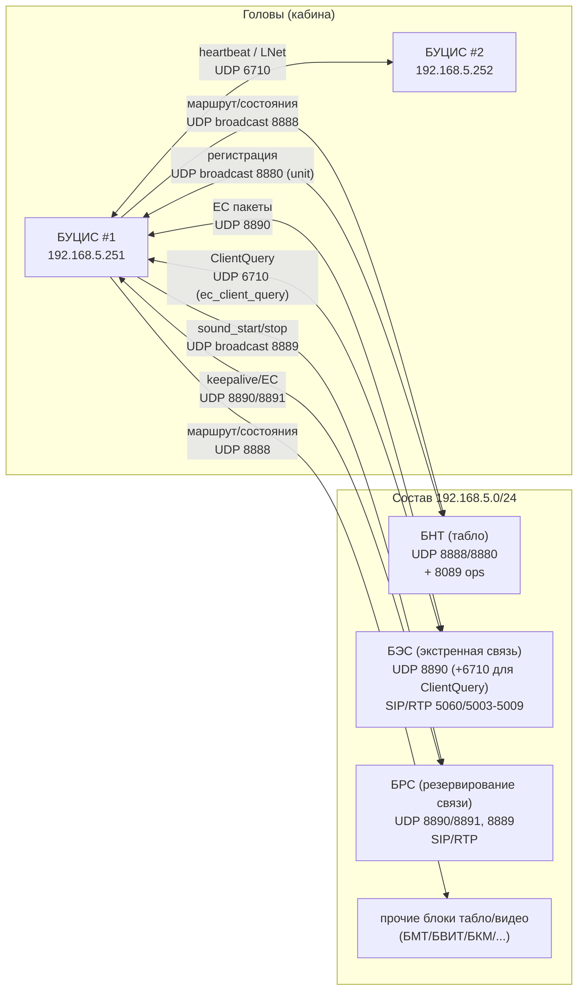
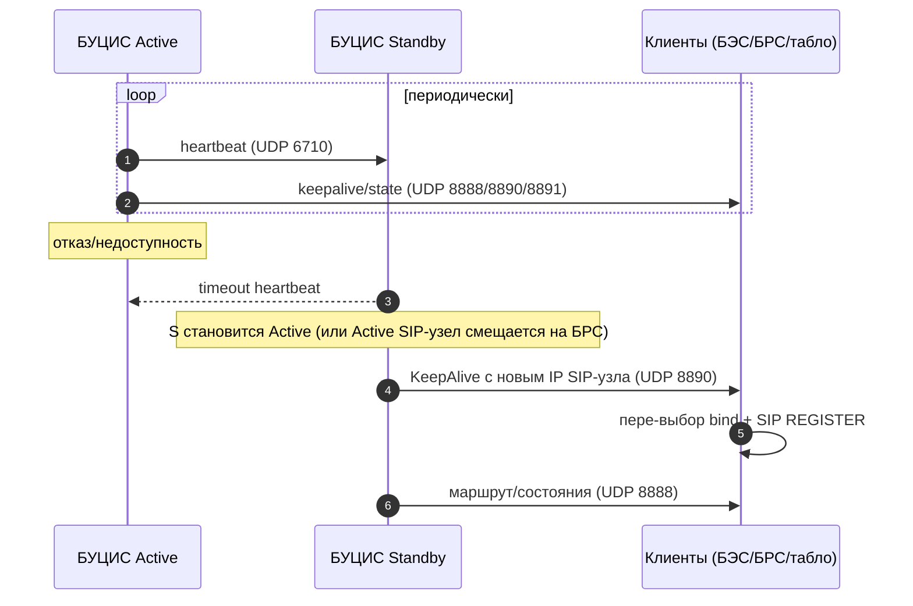
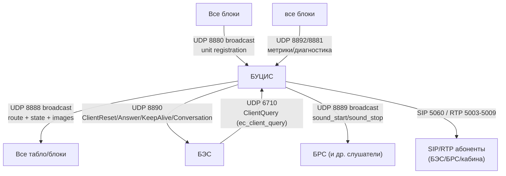
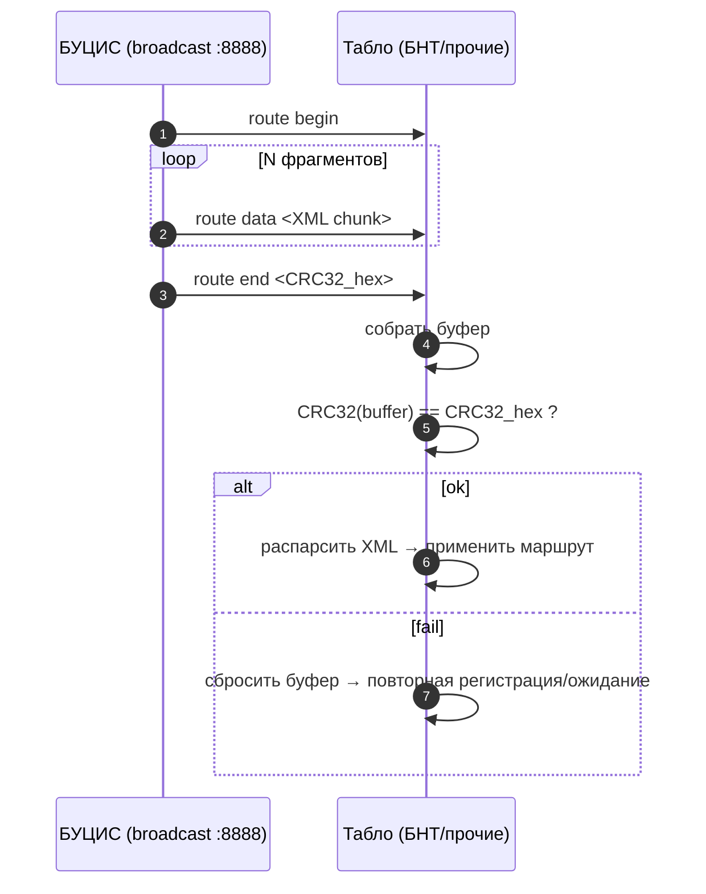
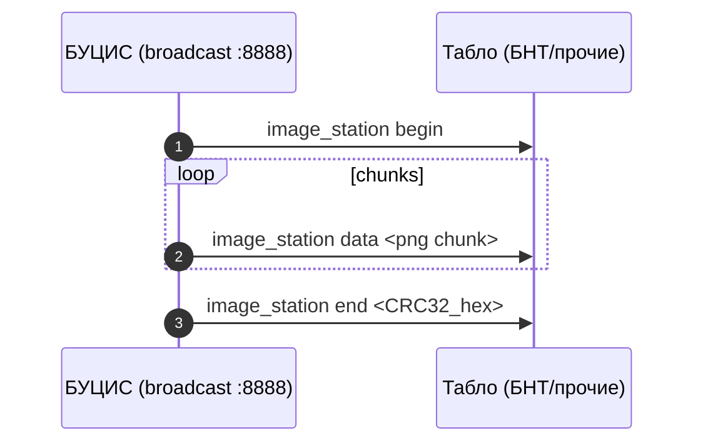
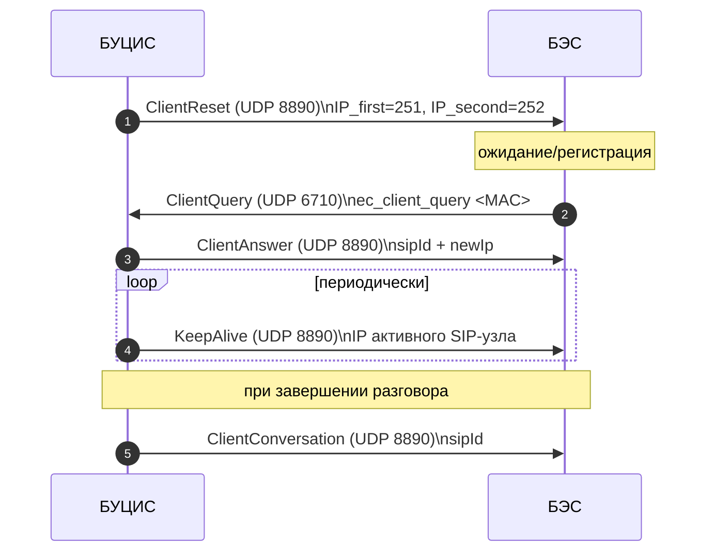

## БУЦИС (БУЦИС-12) — подробная “спека для реализации” по материалам репозитория

Этот документ — **самодостаточное ТЗ** на БУЦИС (БУЦИС-12 САЕШ.468382.012, версия ПО ~1.2), составленное по материалам проекта.

Если в каком-то месте ниже есть “дыра” (не дан точный wire-format пакета, не перечислены все поля, не задано значение по умолчанию), это означает, что **в имеющихся материалах проекта это не зафиксировано**. Такие места помечены как _“не определено в ТЗ (требуется уточнение)”_ и дан практичный способ закрыть вопрос (референс/дамп трафика/согласование).

---

## 1) Роль БУЦИС в системе

**БУЦИС** — центральный головной/хвостовой кабиный компьютер системы «Сармат» (ЦИК Москва) в составе поезда. Его ключевые задачи:

- **Маршрут/информирование**: управляет линиями/маршрутами/станциями, формирует маршрут в формате BNT XML и рассылает его по сети на табло.
- **Состояния поезда**: распространяет текущую станцию/скорость/двери/температуру/время/прочее по UDP.
- **Голос**:
  - локальные объявления/звуки (объявления по маршруту);
  - EC (экстренная связь) через SIP/RTP (Sofia-SIP + GStreamer);
  - синхронный “старт/стоп” звука по составу (UDP 8889) для БРС и других слушателей.
- **Пульт/кабина**: принимает команды от пульта машиниста (UART и/или UDP-каналы SU/SVN), управляет UI/индикацией/параметрами.
- **Резервирование**: в составе обычно 2 головы; активная голова может меняться при отказе. При смене активной головы меняется IP “активного SIP-узла” (OpenSIPS) и клиенты должны переподключиться.

**Типовая сеть состава:** `192.168.5.0/24`, broadcast `192.168.5.255`.

### Схема: БУЦИС как центр взаимодействий



---

## 2) Режимы и “активная голова”

В составе две головы:

- БУЦИС #1: `192.168.5.251`
- БУЦИС #2: `192.168.5.252`

В каждый момент времени предполагается **один активный** БУЦИС:

- рассылает маршрут/команды;
- держит OpenSIPS (или участвует в логике, где OpenSIPS может подниматься на БРС при отказе БУЦИС);
- является источником IP, который передаётся клиентам в keepalive EC.

**Контроль живости**:

- Используется heartbeat между головами по UDP `6710` (LNet).
- В системе предусмотрено резервирование через БРС (по keepalive/aliveEC). Для реализации БУЦИС это означает: **БУЦИС должен корректно работать при смене “активного SIP-узла” на другой IP** и отражать это в keepalive и SIP/bind-логике.

### Схема: переключение активной головы (логика на уровне сигналов)



---

## 3) Что именно реализовывать в БУЦИС (подсистемы)

Ниже — разбиение на подсистемы, требуемое для реализации БУЦИС.

### 3.1. UI + управление маршрутом (кабинный HMI)

- Разрешение **800×480**, полноэкранный режим.
- Выбор линии/маршрута/направления, список станций.
- Управление воспроизведением (станция/доп. контент), микрофоном (громкая/служебная связь), сервисные режимы.

### 3.2. Маршруты и контент (ФС)

Требования к контенту/ФС:

- маршруты лежат в каталогах (примерно `routes/` + подкаталоги линий/маршрутов);
- используются `name.txt`, `config.ini`, каталоги `PNG`, `MP3`, `BNT`;
- в приложении есть логика чтения линий/маршрутов/станций/“extras”.

**Ключевая цель реализации:** уметь собрать маршрут (станции, пересадки, признаки) в **BNT XML** и раздать по UDP 8888 (см. ниже).

### 3.3. UDP подсистема (серверы/клиенты)

БУЦИС одновременно:

- слушает входящие UDP (регистрация устройств, команды от хвоста/соседа, возможно SU/SVN);
- рассылает broadcast-команды табло/блокам;
- ведёт EC-обмен с БЭС/БРС на выделенных портах.

### 3.4. EC телефония (SIP/RTP)

- SIP сигнализация (REGISTER/INVITE/BYE), порт **5060/UDP**;
- RTP аудио (в docs: G.726, порты **5003–5009/UDP**), GStreamer pipeline;
- менеджер звонков: входящие/исходящие, очередь БЭС, автоответ.

### 3.5. Пульт и аппаратные каналы

- Последовательный порт (типовой `/dev/ttymxc4`) — чтение нажатий, управление LED/подсветкой;
- конфиги яркости/громкости/сети, “двойная тяга (УПО)”, амплитудный детектор;
- работа с файлами состояния `/tmp/bucis-12_activation`, `/tmp/bucis-12_doubletrain`.

---

## 4) Сеть, порты и ответственность БУЦИС

Сводно:

### 4.1. UDP порты (основные)

- **6710**: входящие команды от хвоста/соседа; в некоторых вариантах сюда же кладут `ClientQuery` от БЭС (но есть рассогласование, см. ниже).
- **8880**: broadcast входящий (регистрация устройств, `unit ...`).
- **8888**: broadcast исходящий (маршрут/состояние/изображения/команды).
- **8889**: broadcast синхронный звук (`sound_start/stop`).
- **8890**: EC (ClientReset/Answer/KeepAlive/ClientConversation), keepalive EC в сторону БРС.
- **8891**: keepalive (PGK) в сторону БРС.
- **8892/8881**: метрики/диагностика.

Дополнение по “референсной реализации” (типовые константы/определения):

- **8888**: `PORT_TARGET_ROUTEINFO`
- **8889**: `PORT_TARGET_SOUND`
- **8890**: `PORT_TARGET_EMCOMINFO`
- **8891**: `PORT_TARGET_PGKINFO`
- **8892**: `PORT_TARGET_DIAG`
- **8880**: `PORT_LISTEN_BCAST`
- **8881**: `PORT_LISTEN_DIAG`
- **6710**: `PORT_LISTEN_SELF` и `PORT_TARGET_BUCIS`

### Схема: “порт → тип трафика” (с точки зрения БУЦИС)



### 4.2. SIP/RTP

- SIP: **5060/UDP** (OpenSIPS/сигнализация).
- RTP: **5003–5009/UDP** (аудио; кодек в docs — G.726).

### 4.3. Рассогласование порта ClientQuery (важно для реализации)

В материалах проекта (в разделах про БЭС/EC) явно отмечено:

- в одних модулях `ClientQuery` идёт на **6710**,
- в других встречается **7777**.

По фактическим исходникам **БЭС (`BES/UdpHandler`) `ClientQuery` отправляется на UDP `6710`** (константа `PORT_LISTEN_BUCIS=6710` и она реально используется при `sendCmd(...)` на активный БУЦИС).

При этом **`7777` действительно встречается в другом модуле (`BES/Manager/proto.h`) как `PORT_LISTEN_BUCIS=7777`, но в текущем дереве кода это определение не используется** (выглядит как артефакт/рассинхрон варианта сборки).

По имеющемуся референсу **БУЦИС (`src_tmp`) слушает LNet/self на `6710`** (и через него же получает команды протокола “775”, включая `ec_client_query`). Также **`7777` в `BUCIS/src_tmp` встречается только как константа (`PORT_LISTEN_BUCIS`) без точки bind/использования**.

Поэтому реализация БУЦИС должна:

- принимать `ClientQuery` как минимум на **6710** (референсно и подтверждено исходниками БЭС);
- держать порт **конфигурируемым** на случай реального окружения, где кто-то всё же шлёт на **7777**.

---

## 5) Протоколы UDP: форматы и алгоритмы

Ниже — то, что в docs описано достаточно конкретно.

### 5.1. Регистрация устройств (порт 8880): `unit ...`

**Транспорт:** UDP broadcast `192.168.5.255:8880`

**Формат (текст):**
`unit <тип> <MAC-suffix> <IP> <версия>`

**Обработка на БУЦИС:**

- принять, распарсить;
- обновить таблицу “известных устройств” (тип, IP, время последней активности, версия);
- при необходимости инициировать:
  - передачу маршрута по 8888,
  - передачу изображений станций,
  - передачу текущих состояний (`station/doors/speed/...`).

### 5.2. Передача маршрута (порт 8888): `route begin/data/end + CRC32`

**Транспорт:** UDP broadcast `192.168.5.255:8888`

Команды:

- `route begin`
- `route data <XML-фрагмент>`
- `route end <CRC32_hex>`

**Требования к БУЦИС (по ожиданиям получателей, описанным для БНТ):**

- разрезать XML на фрагменты подходящего размера для UDP (в docs нет конкретного MTU/лимита; практично держать payload < 1200 байт);
- гарантировать, что получатель может собрать и проверить CRC32;
- CRC32 указывать в `route end` как hex (в docs примеры `CRC32_hex`).

**CRC32:** использовать CRC32 IEEE (poly \(0x04C11DB7\), отражение входа/выхода, init \(0xFFFFFFFF\), xorout \(0xFFFFFFFF\)).

Точный алгоритм CRC32 (CRC-32/IEEE):

- **poly**: \(0x04C11DB7\)
- **init**: \(0xFFFFFFFF\)
- **refin/refout**: true (по таблице \(0xEDB88320\) и сдвигу вправо)
- **xorout**: \(0xFFFFFFFF\)
- **check**: \(0xCBF43926\) на строке `"123456789"`
- **реализация**: таблица на 256 значений, шаг \(crc = (crc >> 8) ^ table[(crc ^ byte) & 0xFF]\)

Важно про “последовательные вызовы” (это тонкость из сигнатуры/реализации):

- функция объявлена как `osCRC32(data, len, crcinit = CRC32_INIT ^ CRC32_XOROUT)`;
- внутри она делает `crc = crcinit ^ CRC32_XOROUT`, затем считает и возвращает `crc ^ CRC32_XOROUT`;
- поэтому для “одним куском” можно вызывать с дефолтом; для инкрементального подсчёта — прокидывать предыдущий результат как `crcinit`.

#### Схема: передача маршрута фрагментами



### 5.3. Формат BNT XML (что обязано быть совместимо)

Требования к формату:

Корень:

- `<line name="..." isround="true|false">`

Далее:

- `<icon ...>` — символ/цвет линии (в одном месте атрибуты названы `char`+`color`, в другом — `symbol`+`color`; это признак того, что в разных версиях XML/парсера могут быть варианты. Если ты делаешь единую реализацию “как в поле”, нужно взять **тот формат, который понимает целевое табло**.)
- `<station ...>` — станция, атрибуты:
  - `name`,
  - `side="left|right"` (сторона выхода),
  - `cityexit="left|right|both"` (выход в город),
  - `metro-transfer="true|false"`,
  - `skip="true|false"`.
- `<transfer ...>` внутри станции:
  - `name`,
  - `isShow="true|false"`,
  - `crossPlatform="true|false"`,
  - внутри — `<icon ...>`.
- `<feature type="...">` — признаки (`ring-left/right`, `river`, `closed`, …).

**Минимальный набор, чтобы получатель показал маршрут:**

- line (name + isround),
- список station (name),
- иконка линии,
- опционально: transfers/features/side/cityexit/skip.

### 5.4. Передача PNG изображений станций (порт 8888): `image_station begin/data/end`

Команды:

- `image_station begin`
- `image_station data <фрагмент>`
- `image_station end <CRC32_hex>`

Алгоритм идентичен маршруту: буферизация + CRC32 + применение.

#### Схема: передача PNG (image_station)



### 5.5. Команды состояния (порт 8888)

Команды состояния:

- `station <num> <state>` где `state`: `0` прибытие, `1` отправление
- `doors <state_l> <state_r>`
- `speed <value>`
- `temperature <value>`
- `keepalive <IP;speed;date;temp;timeStation;Compositions>`
- `sys_time_stn <t1;t2;...>`
- `date <MMddhhmmyyyy.ss>`
- `reset`
- `work_from_battery <0|1>`

**Тайминги:** в docs приводится пример “keepalive каждые 2 секунды”, но строгого требования нет. Практично: 1–2 секунды.

### 5.6. Оперативные сообщения (порт 8089, для БНТ)

Формат оперативных сообщений:

**JSON:**

```json
{ "text": "<текст>", "time": <сек> }
```

Если БУЦИС должен это поддерживать — это отдельный UDP-канал отправки сообщений, не зависящий от 8888.

### 5.7. Синхронный звук (порт 8889): `sound_start/sound_stop`

Команды:

- `sound_start <тип>;<timestamp_ms>;` где тип: `1` файл, `2` микрофон
- `sound_stop`

Смысл: “всем слушателям стартовать звук синхронно по таймштампу”.

_Что именно “играть” на слушателе_ — определяется конфигом и реализацией слушателя (например БРС). В реализации БУЦИС важно **правильно и вовремя** посылать `sound_start` и `sound_stop`.

#### Схема: синхронный звук по составу

```mermaid
sequenceDiagram
  autonumber
  participant B as БУЦИС
  participant R as БРС/слушатели 8889

  Note over B: начинается объявление/громкая связь
  B->>R: sound_start <type>;<timestamp_ms>;
  Note over R: локально запускается pipeline\nпо конфигу (не задаётся БУЦИС)
  Note over B: завершение
  B->>R: sound_stop
```

### 5.8. EC протокол (порт 8890 + запрос ClientQuery на 6710)

Семантика EC-пакетов:

- `ClientReset` (БУЦИС → БЭС, 8890): содержит IP двух голов (first/second).
- `ClientQuery` (БЭС → БУЦИС, 6710): запрос регистрации (MAC). По фактическим исходникам БЭС (`UdpHandler`) отправка идёт на `6710` (см. §4.3).
- `ClientAnswer` (БУЦИС → БЭС, 8890): `sipId` + `newIp`.
- `KeepAlive` (БУЦИС → БЭС, 8890): IP активного OpenSIPS/SIP-узла (при смене IP клиент перепривязывает SIP).
- `ClientConversation` (БУЦИС → БЭС, 8890): `sipId` — остановить таймер разговора.

**EC wire-format (как текстовые команды, “протокол 775”):** по материалам репозитория EC-обмен реализован **не бинарными struct-пакетами**, а **ASCII-строками команд**.

Важно: EC описан как набор пакетов `ClientReset/ClientQuery/ClientAnswer/KeepAlive/ClientConversation`, но на практике это соответствует **строковым командам** вида `ec_*` (разделители `;`).

#### 5.8.1. Общий формат сообщения EC

- **Кодировка**: ASCII/UTF-8 (по факту команды и аргументы — латиница/цифры/точки/`;`).
- **Разделители**:
  - между именем команды и аргументами — пробел;
  - внутри аргументов — `;`;
  - **терминатор сообщения** — конечный `;` (для команд, где есть `;`-поля; практика протокола 775: `split(';', SkipEmptyParts)`).  
    **Исключение:** `ec_client_query` в фактических исходниках БЭС (`UdpHandler`) формируется как `ec_client_query <MAC>` **без завершающего `;`**.
- **Регистр**: команды в нижнем регистре.
- **Транспорт/порты**:
  - БУЦИС → БЭС: UDP `8890` (ClientReset/ClientAnswer/KeepAlive/ClientConversation).
  - БЭС → БУЦИС: UDP `6710` — подтверждено исходниками БЭС (см. §4.3). Значение `7777` встречается как неиспользуемая константа в другом модуле.

Условная грамматика:

- `message = cmd " " args ";"` (для команд с аргументами)
- `args = field { ";" field }` (последнее `;` обязательно)
- `field = 1*(ALNUM / "." / ":" / "_" / "-")` (практически: IP/MAC/числа)

#### 5.8.2. Сообщения (пакеты) и их строки

Ниже — wire-format строк, которыми в репозитории и документах обозначаются EC-пакеты.

- **ClientReset (БУЦИС → БЭС, UDP 8890)**: “вот IP двух голов”.
  - **Строка**: `ec_client_reset <ip_head1>;<ip_head2>;`
  - **Поля**:
    - `<ip_head1>` — IP первой головы (типично `192.168.5.251`)
    - `<ip_head2>` — IP второй головы (типично `192.168.5.252`)
  - **Пример**: `ec_client_reset 192.168.5.251;192.168.5.252;`

- **ClientQuery (БЭС → БУЦИС, UDP 6710)**: “кто я (MAC) и что случилось (кнопка/событие)”.
  - **Строка (фактически по `BES/UdpHandler`)**: `ec_client_query <mac>`
  - **MAC формат**: обычно `AA:BB:CC:DD:EE:FF` (в документах БЭС — “ClientQuery + MAC”).
  - **Пример**: `ec_client_query 00:11:22:33:44:55`
  - **Примечание**:
    - в текущих исходниках `BES/UdpHandler` **дополнительные поля после MAC не передаются**;
    - при этом референсный обработчик БУЦИС (`Cmdhandler775`) для `ec_client_query` может забирать MAC “как второй токен” (после пробела) и не обязан опираться на `;`.

- **ClientAnswer (БУЦИС → БЭС, UDP 8890)**: “твой `sipId` и куда привязываться”.
  - **Строка**: `ec_client_answer <newIp>;<sipId>;`
  - **Поля**:
    - `<newIp>` — IP, который БЭС должен выставить/использовать
    - `<sipId>` — числовой SIP id/номер абонента
  - **Пример**: `ec_client_answer 192.168.5.120;501;`

- **KeepAlive (БУЦИС → БЭС, UDP 8890)**: “вот IP активного OpenSIPS (и статус/активация)”.
  - **Строка**: `ec_server_keepalive <opensipsIp>;<status>;`
  - **Поля**:
    - `<opensipsIp>` — IP активного SIP-узла (OpenSIPS); при смене головы меняется
    - `<status>` — статус (по `BES/UdpHandler`): `0` — штатное состояние (без сброса), `1` — рестарт
  - **Важно (парсер БЭС)**: в `BES/UdpHandler` при разборе строки ищется **второй символ `;`** (то есть ожидается форма `...;<status>;`). Если не поставить завершающий `;`, `status` может не извлечься корректно.
  - **Пример**: `ec_server_keepalive 192.168.5.251;1;`

- **ClientConversation (БУЦИС → БЭС, UDP 8890)**: “остановить таймер разговора для sipId”.
  - **Строка**: `ec_client_conversation <sipId>;`
  - **Поля**:
    - `<sipId>` — идентификатор абонента
  - **Пример**: `ec_client_conversation 501;`

#### 5.8.3. Что остаётся неопределённым (и что именно нужно приложить, чтобы закрыть полностью)

По фактическим исходникам БЭС (`BES/UdpHandler`) уточнено:

- `ClientQuery` формируется как `ec_client_query <MAC>` (без `;` и без полей после MAC);
- `KeepAlive` формируется как `ec_server_keepalive <ip>;<status>;`, где `status`: `0` — штатно, `1` — рестарт.

Если же в реальном окружении встречаются иные варианты (дополнительные поля в `ClientQuery` или иной смысл `status`), то для “железобетонного” закрытия понадобится одно из:

- исходников/описания модуля **`UdpHandler` БЭС** (где формируется/парсится `ClientQuery` и трактуется `KeepAlive`/`status`);
- либо pcap-дампа EC-трафика со стенда/состава.

#### Схема: регистрация БЭС (EC контур на уровне сообщений)



---

## 6) SIP/RTP (EC телефония) — что следует из docs

Требования по SIP/RTP:

- SIP соответствует RFC 3261 (REGISTER/INVITE/BYE).
- OpenSIPS в системе используется как SIP сервер/регистратор.
- RTP медиа **не проксируется** через OpenSIPS: идёт напрямую между абонентами по SDP.
- Кодек в материалах: **G.726** (допускаются и другие по ТЗ, но в “Сармат” документах фигурирует G.726).
- Порты RTP: **5003–5009** (по таблицам).

Требования к архитектуре SIP/телефонии в БУЦИС (как в референсной реализации):

- в БУЦИС есть подсистема (в оригинале `ec_src/`) со слоями:
  - низкоуровневый `SipClient` (Sofia-SIP),
  - `SipService` (асинхронный запуск/сигналы),
  - `Telephone` (высокоуровневый телефон),
  - `TelephoneHandler` (UI/очередь/режимы/автоответ),
  - `Stream` + `GstMediaPlayer` (GStreamer pipeline),
  - `SettingsService` + bind-файлы (парсер/райтер/файловый вотчер).

**Bind-файлы**:

- содержат SIP параметры: `DOMAIN`, `USER`, `PASS`, `URI`, `DEST_IP`, `DEST`, `PROXY`, SIP/RTP порты и порты записи.
- `SettingsService` должен уметь:
  - выбирать актуальный bind-файл,
  - отслеживать изменения (FileWatcher),
  - перезапускать SIP клиент при смене активного bind (например при смене IP OpenSIPS из keepalive).

---

## 7) Конфигурация (INI/bind/runtime-файлы)

В БУЦИС должны поддерживаться (типовые):

### 7.1. `bucis-12.ini` (основной)

Содержит (как минимум):

- **сеть**: наборы IP (`ipset1/ipset2`), порты SUI/SUE, SVNI/SVNE, broadcast и т.д.;
- **gst-pipeline**: строки pipeline для микрофона/сети/воспроизведения/записи;
- **пути**: маршруты, записи;
- **громкость/яркость**;
- **keys**: последовательный порт пульта (`/dev/ttymxc4`);
- **RTP/record**: порты.

### 7.2. `settings.ini`

Переопределение отдельных параметров, флаги `UNIT`/`IS_BUSIC` и т.п. (по материалам; детали зависят от конкретной сборки).

Дополнение по “референсной конфигурации” (пример реальных строк pipeline и дефолтов):

- Точные pipeline-строки реально присутствуют (это **не “в блоках”, а в INI**):
  - пример `bucis-12.ini`, секция `[gst-pipeline]`:
    - `ext2net="alsasrc device=hw:%1 ! audioconvert noise-shaping=4 ! tee name=n ! queue ! lamemp3enc target=bitrate cbr=true bitrate=128 mono=true ! rtpmpapay ! udpsink port=1234 host=%2 async=false sync=true n. ! queue ! tee name=ss ! queue ! alsasink device=hw:%3 ss. ! queue ! audioconvert mix-matrix=\"<<(float)1.0, (float)0.0>>>\" ! audio/x-raw,channels=1,channel-mask=(bitmask)0x01 ! filesink location=%4"`
    - `file2local="multifilesrc location=%1 start-index=1 stop-index=%2 loop=%3 ! mpegaudioparse ! decodebin ! audioconvert ! volume volume=%4 ! audioresample ! alsasink device=hw:1"`
    - `file2net="multifilesrc location=%1 start-index=1 stop-index=%2 loop=%3 ! mpegaudioparse ! rtpmpapay ! udpsink port=1234 host=%4 async=false sync=true"`
    - `mic2file="alsasrc ! audioconvert noise-shaping=4 ! lamemp3enc target=bitrate cbr=true bitrate=128 mono=true ! filesink location=%1"`
    - `mic2net="alsasrc ! audioconvert noise-shaping=4 ! tee name=n ! queue ! lamemp3enc target=bitrate cbr=true bitrate=128 mono=true ! rtpmpapay ! udpsink port=1234 host=%1 async=false sync=true n. ! queue ! mulawenc ! wavenc ! filesink location=%2"`
    - `mixsrc2net="%1 ! audioresample ! audio/x-raw,rate=32000,channels=2 ! tee name=ss ! queue ! audioconvert mix-matrix=\"<<(float)0.0, (float)1.0>, <(float)1.0, (float)0.0>>\" ! audioresample ! %2 ss. ! queue ! audioconvert mix-matrix=\"<<(float)1.0, (float)1.0>>\" ! tee name=ss2 ! queue ! audioresample ! avenc_g726 bitrate=32000 ! rtpg726pay ! udpsink port=5006 host=%3 async=false sync=true ss2. ! queue ! udpsink port=5009 host=127.0.0.1 async=false sync=true"`
    - `net2ext="udpsrc port=5006 caps=\"application/x-rtp,media=(string)audio\" ! rtpg726depay ! avdec_g726 ! audioconvert mix-matrix=\"<<(float)1.0>, <(float)1.0>>\" ! audioresample ! alsasink device=hw:1 buffer-time=80000"`
    - `net2file="interleave name=i ! audio/x-raw,channels=2,channel-mask=(bitmask)0x03 ! mulawenc ! wavenc ! filesink location=%1 udpsrc port=5004 caps=\"application/x-rtp,media=(string)audio\" ! rtpg726depay ! avdec_g726 ! audioconvert !  webrtcechoprobe name=webrtcechoprobe0 ! audio/x-raw,channels=1,channel-mask=(bitmask)0x01 ! queue ! i.sink_0 udpsrc port=5005 caps=\"application/x-rtp,media=(string)audio\" ! rtpg726depay ! avdec_g726 ! audioconvert ! audio/x-raw,channels=1,channel-mask=(bitmask)0x02 ! queue ! i.sink_1"`
    - `sigdetector="%1 ! audioresample ! audio/x-raw,rate=32000,channels=2 ! audioresample ! audioconvert mix-matrix=\"<<(float)1.0, (float)1.0>>\" ! udpsink port=5009 host=127.0.0.1 async=false sync=true"`
    - `mic2head="alsasrc ! audio/x-raw,rate=32000,channels=2 ! audioconvert ! audioresample ! avenc_g726 bitrate=32000 ! rtpg726pay ! udpsink port=5008 host=%1 async=false sync=true"`
    - `head2play="udpsrc port=5008 caps=\"application/x-rtp,media=(string)audio\" ! rtpg726depay ! avdec_g726 ! alsasink buffer-time=80000"`
  - пример `settings.ini`, секция `[GSTREAMER]`:
    - `PIPELINE="%1 ! audioconvert noise-shaping=4 ! webrtcdsp echo-suppression-level=2 noise-suppression-level=3 voice-detection=true compression-gain-db=90 target-level-dbfs=4 ! avenc_g726 bitrate=32000 ! rtpg726pay ! tee name=tmb12 ! queue ! udpsink port=%2 host=%3 async=FALSE tmb12. ! queue ! udpsink port=%5 host=127.0.0.1 async=FALSE udpsrc port=%4 caps=\"application/x-rtp,media=(string)audio\" ! tee name=tpb12 ! queue ! rtpg726depay ! avdec_g726 ! audioconvert noise-shaping=4 ! webrtcechoprobe name=webrtcechoprobe0 ! alsasink buffer-time=80000 tpb12. ! queue ! udpsink port=%6 host=127.0.0.1 async=FALSE"`
    - `MICSRC="alsasrc buffer-time=80000"`
    - `DUMMYSRC="audiotestsrc wave=silence"`
- Парсер/ключи/дефолты:
  - референсный парсер читает `[UNIT]` (`IS_BUSIC`, дефолт `"false"`) и `[GSTREAMER]` (`PIPELINE/MICSRC/DUMMYSRC`, дефолт `""`).
  - референсный сервис настроек читает `settings.ini` как `path + "/settings.ini"` и хранит значения в структуре настроек приложения.

### 7.3. `setup.ini`

Альтернативный “пакет настроек” (carnum/ipset/route/volume/keys).

### 7.4. Bind-файлы `*.bind`

Хранят SIP-учётки. Важный сценарий: при смене active-узла keepalive приносит новый IP, и клиент перечитывает bind и перерегистрируется.

### 7.5. Runtime-файлы `/tmp/...`

Runtime-файлы состояния:

- `/tmp/bucis-12_activation`
- `/tmp/bucis-12_doubletrain`

Это флаги/состояния для УПО/двойной тяги.

---

## 8) Алгоритмы/циклы работы (минимум необходимого)

### 8.1. Инициализация (startup)

1. Загрузить конфиги (INI + bind), определить свой IP/роль (голова/хвост, ipset).
2. Поднять UDP-приёмники:
   - 8880 (unit registration),
   - 6710 (LNet/хвост/сосед, ClientQuery),
   - при необходимости SU/SVN каналы.
3. Подготовить UDP-отправитель 8888/8889 и EC отправитель 8890/8891.
4. Загрузить файловую модель маршрутов (линии/маршруты/станции/контент).
5. Запустить SIP/TelephoneHandler:
   - выбрать актуальный bind,
   - зарегистрироваться,
   - подготовить GStreamer pipelines.
6. Поднять последовательный порт пульта (если включено).
7. Перейти в основной цикл: таймеры keepalive/состояний/обновления UI.

### 8.2. Периодическая рассылка на 8888 (state loop)

С периодом 1–2 секунды:

- `keepalive ...` (в формате `IP;speed;date;temp;timeStation;Compositions`)
- при изменениях: `station`, `doors`, `speed`, `temperature`, `date`, `sys_time_stn`

При смене маршрута:

- `route begin/data/end` (+ при необходимости `image_station begin/data/end`).

### 8.3. Регистрация устройств (приём `unit`)

На `unit ...`:

- обновить “последний раз видел”;
- если устройство новое или недавно не видели — отправить ему актуальный маршрут/состояние (в docs это broadcast, т.е. просто повторить broadcast).

### 8.4. Синхронный звук (8889)

При начале объявления/громкой связи:

- послать `sound_start <тип>;<timestamp_ms>;`
  При завершении:
- послать `sound_stop`

### 8.5. EC (BES) регистрация (8890 + ClientQuery port)

Минимальная логика на стороне БУЦИС (в терминах docs):

- уметь отправлять `ClientReset` с IP двух голов;
- принимать `ClientQuery` (MAC + событие);
- выдавать `ClientAnswer` (назначить `sipId`, вернуть `newIp`/активный IP);
- периодически слать `KeepAlive` с IP активного OpenSIPS/SIP-узла;
- при событиях разговора слать `ClientConversation` по `sipId`.

Повторюсь: точные бинарные форматы этих пакетов в этом репозитории **не определены**, их надо восстановить по референсу или зафиксировать самостоятельно.

---

## 9) Что в документах явно “есть”, но недостаточно специфицировано

Это список “рисков/недостающих данных”, который обычно всплывает при реализации:

- **Wire-format EC пакетов** (`ClientReset/Query/Answer/KeepAlive/ClientConversation`) — в docs описаны поля, но не указано:
  - бинарный формат/разделители,
  - endian,
  - размеры,
  - CRC/подписи (если есть).
- **CRC32 для маршрута/PNG**: в материалах указан как CRC32; точный вариант в этом ТЗ зафиксирован в §5.2 (CRC-32/IEEE, check \(0xCBF43926\)).
- **Точные строки GStreamer pipeline**: в материалах описаны концептуально (“строки pipeline в INI”); в этом ТЗ приведён конкретный пример строк в §7.2.
- **Протокол “775” команд**: перечислены команды, но если в окружении ожидается иной вариант параметров/полей — потребуется референс/сниффер/дамп трафика для сверки.

---

## 10) Практичный чеклист “чтобы реализовать и запустить”

Если твоя задача именно “написать заново БУЦИС”, минимальный план вывода в эксплуатацию будет таким:

- Реализовать и отладить UDP 8888:
  - `route begin/data/end` с BNT XML и CRC32, чтобы БНТ гарантированно принял маршрут.
  - `station/doors/speed/temperature/keepalive/date/sys_time_stn`.
  - `image_station begin/data/end` (если требуется на табло).
- Реализовать UDP 8880 (unit):
  - принимать регистрацию устройств и поддерживать таблицу устройств.
- Реализовать UDP 8889:
  - `sound_start/sound_stop` (с синхронизацией по timestamp_ms).
- Реализовать EC “контур” (8890 + ClientQuery port):
  - зафиксировать формат `ec_client_query` и порт приёма `ClientQuery` (референсно/по исходникам БЭС — `6710`; `7777` держать как опциональный конфиг на случай другого окружения).
- Реализовать SIP/RTP:
  - bind-файлы + автоперерегистрация при смене active IP OpenSIPS,
  - INVITE/BYE, RTP.
- Вынести в конфиг:
  - IP/роль/набор ipset,
  - порты UDP,
  - пути к маршрутам,
  - GStreamer pipelines,
  - порт UART.

---

## 11) Дополнения (важное для реализации, но выше не расписано)

### 11.1. Слои/модули “как в референсном проекте”

Материалы проекта описывают референсную структуру (Qt/C++), полезную как ориентир архитектуры даже если ты пишешь заново:

- **Глобальные настройки/сеть**: аналог `OSGlobal` — загрузка INI, выбор ipset, вычисление “self/broadcast/SU/SVN/tail”, флаги “invalidContent/invalidIPs”.
- **Главное окно/оркестратор**: аналог `OSMainWindow` — связывает UI, UDP, SIP, serial, маршруты, плееры, таймеры.
- **Парсер/диспетчер команд**: аналог `Cmdhandler775` — единая точка разбора входящих UDP-команд и развязка по обработчикам/сигналам.
- **Последовательный порт**: аналог `OSSerial` — чтение пакетов кнопок, CRC, управление индикацией.
- **CRC**: CRC8/CRC32 (для пакетов/файлов), где CRC32 точно участвует в маршруте/PNG.
- **Аудио**:
  - локально: `QMediaPlayer` для MP3;
  - сеть/микрофон/телефония: GStreamer pipelines из INI.

### 11.2. UDP серверы/каналы, которые упомянуты в материалах проекта

Там перечислены отдельные UDP-каналы (в референсе поднимались как серверы):

- **LNet**: self address, порт 6710 (команды с линии/хвоста/соседа).
- **Broadcast**: приём broadcast-команд (8880).
- **SUI/SUE**: обмен с пультом (SU) по внутреннему/внешнему интерфейсу.
- **SVNI/SVNE**: обмен с сетевым оборудованием (SVN).

Для “реализации заново” это означает: помимо “основных” 8888/8880/8890/8889 надо продумать:

- какие входящие команды реально приходят на 6710 (кроме ClientQuery БЭС);
- какие команды и форматы идут по SUI/SUE, SVNI/SVNE (в имеющихся материалах проекта это не формализовано).

### 11.3. Перечень команд, которые упомянуты как поддерживаемые обработчиком команд “775”

Список из документа (без wire-format):

- `keepalive`
- `unit`
- `sys_info`
- `reg_data_request`
- `ec_client_query`
- `new_route`
- `double_train`
- `image_request`
- `diagerrors`
- а также команды, связанные с обновлением маршрутов: `start_remove_route`, `end_remove_route`, `start_copy_route`, `end_copy_route`, `end_update`, `percent`.

**Важно:** в имеющихся материалах проекта нет полного описания формата “протокола 775” и его полей; ниже приведён разбор фактического поведения из референсной реализации. Если же у вас целевая система ожидает иной вариант — нужен дамп UDP трафика/референс для сверки.

#### 11.3.1. “Реальный” формат/разбор протокола 775 по референсной реализации

По факту это **текстовые команды** (имя + аргументы, разделитель `;`) плюс отдельная “передача файла кусками” для `settings`.

Ключевые детали поведения:

- **Link/keepalive хвоста**:
  - команда `keepalive` считается валидной для линка, только если `srcaddr == addrTail` и `srcport == 6710`;
  - линк считается “живым”, пока приходят keepalive; таймаут реализован счётчиком `THRS_ACK = 40` на таймере 100 мс (то есть порядка **4 секунд** без keepalive → `link(0)`).
- **Разделение аргументов**: почти везде `cmdArg.split(';', SkipEmptyParts)`.
- **Особый “MSK-режим”** (`m_trainMSKflag`): если `portSVNI == 0 && portHostSVNI == 0`, то для части команд первый токен трактуется как служебный и удаляется (например в `sys_time_stn` удаляется первые 6 символов строки, а в `diag_train_ack` удаляется первый элемент списка).
- **`sys_btn` / `dpy_btn`**:
  - из аргумента берётся поле с бинарной строкой (`"010101..."`), удаляются `;`, затем парсится `toUShort(..., 2)` (то есть **кнопки приходят битовой маской в ASCII-бинарном виде**).
- **`can_encap`**:
  - ожидается `tmp[0] == "231"`, далее 8 байт-значений в hex по одному байту в поле; собираются два `uint32` в little-endian порядке:
    - `dw = b0 | (b1<<8) | (b2<<16) | (b3<<24)`.
- **`settings` (двоичный payload) + begin/data/end + CRC32**:
  - это отдельный обработчик `handle(cmdName, QByteArray cmdArgData, ...)`;
  - формат кусков — **ASCII-префикс до `;`** + данные:
    - `begin;` — очистить буфер,
    - `data;<bytes...>` — дописать bytes “как есть” (ограничение размера буфера **65536**),
    - `end;<crc_decimal>` — посчитать CRC32 по буферу и сравнить с `toUInt()` (то есть CRC передаётся **в десятичном виде**, не hex).
  - при успехе и если CRC отличается от текущего — `writeSettings(data)` и сигнал `settings()`.

Итого: “775” здесь — это не какой-то скрытый бинарный кадр, а **набор именованных команд**, где аргументы обычно строковые `;`-поля; бинарь встречается только как “кусок данных после `data;`” в `settings`.

### 11.5. Типы устройств/ошибки (для совместимости)

Если в реализации нужен маппинг устройств и статусов (например для диагностики/таблицы “кто в составе”), референс фиксирует:

- **DeviceTypes**:
  - `TY_BMCIK=0x00`, `TY_MIES=0x01`, `TY_MDU=0x02`, `TY_BNT_SND=0x03`, `TY_BNT_LCD=0x04`,
  - `TY_BES=0x05`, `TY_BMT=0x06`, `TY_BIKM=0x07`, `TY_BVIT=0x08`, `TY_BPM=0x09`,
  - `TY_BVT=0x0A`, `TY_MUGS=0x0B`, `TY_BRM=0x0C`, `TY_BKM=0x0D`, `TY_BNM=0x0E`,
  - `TY_BL=0x0F`, `TY_BIT=0x10`, `TY_UNDEFINED=0x1F`.
- **Флаги ошибок**: `HB_ERROR=0x01`, `TEMP_ERROR=0x02`, `SOUND_ERROR=0x04`, `DISPLAY_ERROR=0x08`, `STORAGE_ERROR=0x10` (и `NO_ERROR=0x00`).

### 11.6. UART протокол пульта по референсной реализации

Здесь wire-format как раз есть “в лоб”, без догадок.

**Параметры порта:**

- **115200**, 8N1, без flow-control.
- По умолчанию имя порта берётся из `bucis-12.ini`: секция `[keys]`, ключ `port` (в референсе `/dev/ttymxc4`).

**Входящий кадр (6 байт), `OSSerialData` (`__attribute__((packed))`):**

- `prefix` = `0x55`
- `key_int` (1 байт)
- `key_ext1` (1 байт)
- `key_ext2` (1 байт)
- `crc` (1 байт)
- `postfix` = `0xAA`

**Проверка целостности входящего кадра:**

- `crc == (key_int ^ key_ext1 ^ key_ext2)` (простая XOR-сумма, **не CRC8**).

**Смысл данных клавиш:**

- три байта ключей (`key_int/key_ext1/key_ext2`) трактуются как один `uint32` (структура `OSKeyData` с полем `data`),
- наружу отдаётся 24-битная маска: `keys & 0x00FFFFFF`.

**Исходящий кадр управления (4 байта) — LED/BS/подсветка линии:**

- формируется `uint32 framedata = 0xAA000055` (то есть `[0]=0x55 ... [3]=0xAA`),
- `data` кладётся в байт `[1]`, `crc = ~data` кладётся в байт `[2]`.

**Замечание про CRC8:**

- В референсной реализации есть табличный CRC8, но для кадров пульта он не используется.

### 11.4. Конфиги/пути/платформа (зафиксировано в материалах проекта)

- **Qt5** (widgets/multimedia/network/serialport), целевая платформа ARMHF, запуск в полноэкранном режиме.
- **Пульт**: `/dev/ttymxc4` по умолчанию (но должен быть параметризуемым).
- **Два набора IP (ipset1/ipset2)**: использовать для разных топологий (голова/хвост, два состава и т.п.).
- **Runtime-файлы**: `/tmp/bucis-12_activation`, `/tmp/bucis-12_doubletrain` для УПО/двойной тяги.
